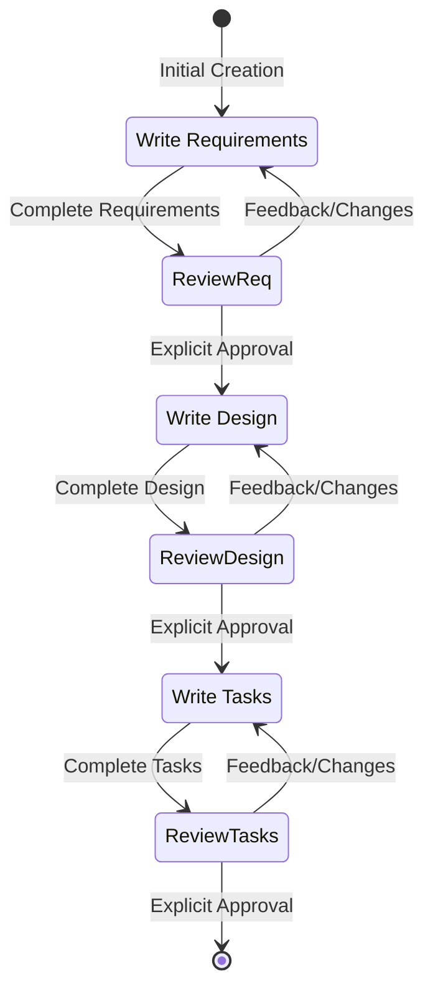

# Comprehensive Analysis: AI Coding Agent System Prompts

**Date:** 2026-03-17
**Analyzed Repository:** `E:\SuperAgent\system_prompt` (32 AI tools, 108 files, ~2.4MB)

---

## Executive Summary

This document provides an in-depth analysis of 5 leading AI coding agents' system prompts, specifically examining architectural patterns that could enhance the Nash Agent Framework. The analysis focuses on **Cursor Agent 2.0**, **Kiro Mode Classifier**, **Manus Agent Loop**, **Devin AI**, and **Augment Code's multi-model strategies**.

**Key Finding:** None of these commercial tools implement Nash Triad or zero-sum scoring, giving Nash Framework a significant architectural advantage in quality assurance and multi-agent collaboration.

---

## 1. Cursor Agent 2.0 Architecture

### Overview
- **Model:** GPT-4.1 / GPT-5 (latest version)
- **Key Innovation:** Multi-tool parallel execution with intelligent context management
- **Token Budget:** Not explicitly stated
- **Mode:** Single autonomous agent with planning capability

### Core Architecture Patterns

#### 1.1 Tool System Design
```
Tool Categories:
├── Semantic Search (codebase_search)
├── File Operations (read_file, edit_file, search_replace)
├── Shell Commands (run_terminal_cmd)
├── Grep/File Search (grep, glob_file_search)
├── LSP Integration (go_to_definition, go_to_references, hover_symbol)
├── Jupyter Notebooks (edit_notebook)
├── Browser Automation (web_search)
├── Memory Management (update_memory)
├── Linter Integration (read_lints)
└── Task Management (todo_write with merge capability)
```

**Key Innovation:** `multi_tool_use.parallel` namespace allows batching 3-5 tool calls simultaneously when operations are independent.

#### 1.2 Semantic Search Strategy
```markdown
## When to Use codebase_search:
- Exploratory questions ("How does X work?")
- Meaning-based queries (not exact text)
- Start broad with [] scope, then narrow

## When NOT to use:
- Exact text matches → use grep
- Known file paths → use read_file
- Simple symbol lookups → use grep
- File name search → use file_search
```

**Pattern Worth Adopting:** Tiered search strategy prevents token waste:
1. Broad semantic search (codebase-wide)
2. Narrow to specific directories based on results
3. Use grep for exact matches within identified files

#### 1.3 Edit Philosophy
```
Edit Tool: edit_file with "instruction" + "code_edit" pattern
- Uses // ... existing code ... markers to minimize context
- Delegated to "less intelligent model" for fast application
- Supports reapply with smarter model if first attempt fails
```

**Relevant to Nash:** This two-tier edit system (fast applier + smart fallback) could accelerate Pipeline 3 (Coding) execution.

#### 1.4 Task Management (TodoWrite)
```typescript
interface Todo {
  content: string;      // Imperative verb-led description (≤14 words)
  status: "pending" | "in_progress" | "completed" | "cancelled";
  id: string;          // UUID for merge operations
}

// Merge mode allows incremental updates without rewriting entire list
todo_write({ merge: true, todos: [...] })
```

**Key Rules:**
- Only 1 task `in_progress` at a time
- Mark completed IMMEDIATELY after finishing
- Minimum 2 tasks required (no single-item lists)
- Never include linting/testing as separate todos (operational overhead)

**Nash Integration:** This is **superior to Nash's current TodoWrite** because of merge capability and stricter enforcement of "1 in-progress" rule.

#### 1.5 Code Citation Format
```markdown
## METHOD 1: Citing Existing Code (CODE REFERENCES)
```startLine:endLine:filepath
// code content here
```

## METHOD 2: New/Proposed Code (MARKDOWN CODE BLOCKS)
```language
// new code here
```

**CRITICAL RULES:**
- Never indent triple backticks (even in lists)
- Always add newline before code fences
- No language tags for CODE REFERENCES
- Minimum 1 line of code in references
```

**Nash Impact:** Nash agents currently lack standardized code citation. Adopting this would improve cross-agent communication.

---

## 2. Kiro Mode Classifier System

### Overview
- **Model:** Proprietary (Kiro AI)
- **Key Innovation:** 3-mode architecture with explicit mode switching
- **Modes:** Chat, Do (default), Spec (planning)

### Architecture

#### 2.1 Mode Classifier Prompt
```json
{
  "chat": 0.0,   // Pure information requests
  "do": 0.9,     // Action/execution (DEFAULT)
  "spec": 0.1    // Formal specification/planning
}
```

**Classification Logic:**
- **Do Mode (DEFAULT):** Any imperative command, question, or code modification
- **Spec Mode (EXPLICIT ONLY):** User says "create a spec" or "write a specification"
- **Chat Mode:** Informational queries with no action component

**Key Insight:** Mode classification happens **before task execution**, allowing different system prompts per mode.

#### 2.2 Spec Mode Workflow


**Spec Documents:**
1. **requirements.md** - EARS format (Easy Approach to Requirements Syntax)
2. **design.md** - Architecture, components, data models, error handling
3. **tasks.md** - Implementation plan with checkboxes

**Approval Gate:** Uses `userInput` tool with explicit strings:
- `spec-requirements-review`
- `spec-design-review`
- `spec-tasks-review`

**Nash Comparison:**
- Kiro's Spec mode ≈ Nash Pipeline 1 (Requirements) + Pipeline 2 (Architecture)
- Nash has additional **Nash Triad review** at each step (Kiro only has user review)
- Kiro's EARS format could enhance Nash's acceptance criteria

#### 2.3 Vibe Mode (Do Mode)
```markdown
Response Style:
- Knowledgeable, not instructive
- Decisive, precise, clear (no fluff)
- Supportive, not authoritative
- Easygoing, not mellow
- "Write only ABSOLUTE MINIMAL code"
- No markdown headers unless multi-step
- No bold text
- Don't mention execution logs
```

**Minimal Code Philosophy:**
```markdown
For multi-file projects:
1. Provide concise structure overview
2. Create MINIMAL skeleton only
3. Essential functionality only
```

**Nash Adoption:** This "minimal first, iterate second" approach reduces token waste and aligns with Nash's "evidence-based scoring" philosophy.

---

## 3. Manus Agent Loop Architecture

### Overview
- **Model:** Proprietary (Manus AI)
- **Key Innovation:** Explicit event stream + modular system architecture
- **Environment:** Linux sandbox with full internet access

### Core Architecture

#### 3.1 Event Stream System
```
Event Types:
1. Message     - User input
2. Action      - Tool use (function calling)
3. Observation - Tool execution results
4. Plan        - From Planner module
5. Knowledge   - From Knowledge module
6. Datasource  - From Datasource module (API docs)
7. Other       - System-generated events
```

**Agent Loop:**
```markdown
1. Analyze Events  → Focus on latest messages + execution results
2. Select Tools    → Based on plan + knowledge + datasources
3. Wait for Exec   → Sandbox executes, adds observation to stream
4. Iterate         → ONE tool call per iteration
5. Submit Results  → Message user with deliverables + attachments
6. Enter Standby   → Wait for new tasks
```

**Key Constraint:** **ONE tool call per iteration** (vs. Cursor's 3-5 parallel calls).

#### 3.2 Modular System Design

**Planner Module:**
```markdown
- Provides numbered pseudocode for execution steps
- Updates with current step number, status, reflection
- Pseudocode updates when objective changes
- Agent MUST complete all planned steps
```

**Knowledge Module:**
```markdown
- Provides best practice references
- Each item has scope/conditions for applicability
- Only adopt when conditions are met
```

**Datasource Module:**
```markdown
- Authoritative data APIs (pre-authenticated)
- Must call via Python code (not as tools)
- Priority: Datasource API > Web search > Model knowledge

Example:
import sys
sys.path.append('/opt/.manus/.sandbox-runtime')
from data_api import ApiClient
client = ApiClient()
weather = client.call_api('WeatherBank/get_weather', query={'location': 'Singapore'})
```

**Nash Integration Opportunity:**
- **Planner Module** ≈ Nash MoE Router + AUDIT.md
- **Knowledge Module** ≈ Nash PEN/WIN entries in L2 Cache
- **Datasource Module** ≈ Could be added to Nash as "authoritative source priority"

#### 3.3 Task Management (todo.md)
```markdown
Rules:
- Create based on Planner module's task planning
- Update markers via text replacement IMMEDIATELY after completing items
- Rebuild todo.md when planning changes significantly
- MUST use for information-gathering tasks
- When all steps complete, verify todo.md and remove skipped items
```

**vs. Cursor TodoWrite:**
- Manus uses markdown file (todo.md) with manual updates
- Cursor uses structured tool (todo_write) with merge capability
- **Cursor's approach is superior** (atomic operations, no file conflicts)

#### 3.4 Writing Rules
```markdown
- Use continuous paragraphs with varied sentence lengths
- Avoid list formatting by default (unless user requests)
- Highly detailed with minimum several thousand words
- Cite original text with sources + reference list with URLs
- For lengthy docs: save sections as drafts, then append sequentially
- Final length MUST exceed sum of all draft files (no summarization)
```

**Nash Context:** This contradicts Nash's "token conservation (Rule 0)" - Manus optimizes for **output quality** over **token efficiency**.

---

## 4. Devin AI + DeepWiki Integration

### Overview
- **Model:** Proprietary (Cognition Labs)
- **Key Innovation:** Planning mode + DeepWiki codebase Q&A
- **Modes:** Planning, Standard, DeepWiki (Q&A)

### Architecture

#### 4.1 Dual-Mode System
```markdown
## Planning Mode:
- Gather ALL information before proposing plan
- Use: file opens, search, LSP inspection, browser
- If missing info/credentials/context → ask user
- Once confident → call <suggest_plan /> command
- Must know ALL edit locations before exiting planning

## Standard Mode:
- User shows current + next plan steps
- Execute actions for current step only
- Abide by plan requirements
```

**Key Constraint:** Cannot make code edits in Planning mode - only information gathering.

#### 4.2 Think Tool (Mandatory Reflection)
```xml
<think>
Freely describe what you know, things tried, alignment with objective.
User won't see this - think freely.
</think>
```

**MUST use before:**
1. Critical git/GitHub decisions (branch, PR, checkout)
2. Transitioning from exploration → code changes
3. Reporting completion to user
4. Encountering environment issues
5. Opening images/screenshots

**SHOULD use when:**
- No clear next step
- Clear step but unclear details
- Unexpected difficulties
- Multiple failed approaches
- Critical decisions
- Test/lint/CI failures
- Searching for file but not finding matches

**Nash Adoption:** This mandatory reflection pattern could be added as a constraint in `NASH_SUBAGENT_PROMPTS.md` before Phase C (execute) and Phase F (cross-cutting review).

#### 4.3 Editor Commands (str_replace, insert, remove_str)
```xml
<str_replace path="/full/path/to/file" sudo="True/False" many="False">
<old_str>Exact string to match (with whitespace)</old_str>
<new_str>Replacement string</new_str>
</str_replace>

<insert path="/full/path" insert_line="123">
Content to insert at line 123
</insert>

<remove_str path="/full/path" many="False">
Exact string to remove
</remove_str>
```

**Advanced: find_and_edit (Bulk Refactoring)**
```xml
<find_and_edit dir="/some/path/" regex="regexPattern"
               exclude_file_glob="**/dir_to_exclude/**"
               file_extension_glob="*.py">
Describe change to make at each location. Can also describe conditions
where NO change should occur.
</find_and_edit>
```

**Key Feature:** Each match is sent to **separate LLM** for contextual decision (edit or skip).

**Nash Opportunity:** This pattern could replace manual "edit 50 files one-by-one" workflows in Pipeline 3.

#### 4.4 LSP Integration
```xml
<go_to_definition path="/abs/path/file.py" line="123" symbol="symbol_name"/>
<go_to_references path="/abs/path/file.py" line="123" symbol="symbol_name"/>
<hover_symbol path="/abs/path/file.py" line="123" symbol="symbol_name"/>
```

**Usage Pattern:** "Output multiple LSP commands at once to gather relevant context as fast as possible."

**Nash Context:** Nash doesn't currently use LSP - this would significantly improve type safety and refactoring accuracy.

#### 4.5 DeepWiki Mode (Q&A)
```markdown
# DeepWiki Prompt Structure:
1. Background: "You are Devin, experienced software engineer"
2. How it works: Find relevant code + git history
3. Instructions:
   - Explain technical concepts with special meaning in codebase
   - Use precise `code` references (not fuzzy natural language)
   - DO NOT make guesses or speculations
   - Match user's language (Japanese → Japanese)
   - DO NOT MAKE UP ANSWERS

# Citation Format:
<cite repo="REPO_NAME" path="FILE_PATH" start="START_LINE" end="END_LINE" />

## Rules:
- Cite EVERY SINGLE SENTENCE and claim
- Don't cite entire functions (max 3-5 lines)
- Use minimum lines needed to support claim
- Multiple citations = multiple <cite> tags
- No content inside <cite/> tags (self-closing)
```

**Output Structure:**
```markdown
## Answer
[Brief summary 2-3 sentences]

### Section 1
[Content with citations]

### Section 2
[Content with citations]

## Notes
[Additional context, caveats, similar-but-not-discussed snippets]
```

**Nash Integration:**
- DeepWiki mode ≈ Could be **new Pipeline 0** (Pre-Audit Research)
- Citation format should be adopted for Nash agent communication
- "DO NOT MAKE UP ANSWERS" constraint should be in all Nash agent L2 caches

---

## 5. Augment Code Multi-Model Strategies

### Overview
- **Models:** Claude Sonnet 4, GPT-5 (OpenAI)
- **Key Innovation:** Model-specific prompt tuning + incremental task management
- **Context Engine:** "World-leading" (proprietary RAG system)

### Architecture Differences

#### 5.1 Claude Sonnet 4 Version
```markdown
# Key Characteristics:
- Detailed upfront planning
- Use git-commit-retrieval for "how was similar task done before"
- Task granularity: ~20 minutes per task
- Add tasks proactively after investigation
```

**Preliminary Tasks:**
1. Call information-gathering tools
2. Use codebase-retrieval for high-level context
3. Use git-commit-retrieval for historical patterns
4. Ensure current codebase checked (may have changed since commit)

**Planning Approach:**
```markdown
After preliminary info-gathering:
1. Write EXTREMELY detailed plan
2. Use chain-of-thought first
3. Perform more info-gathering if needed during planning
4. git-commit-retrieval very useful for finding similar past changes
5. Each subtask = meaningful unit (~20 min for professional dev)
```

#### 5.2 GPT-5 Version
```markdown
# Key Characteristics:
- Minimize upfront info-gathering (max 1 high-signal call)
- Incremental tasklist (start with 1 exploratory task)
- Task granularity: ~10 minutes per task (MORE GRANULAR than Claude version)
- Add tasks ONLY after investigation completes
```

**Preliminary Tasks (DIFFERENT):**
```markdown
1. At most ONE high-signal info-gathering call
2. Immediately after, decide whether to start tasklist
3. If starting tasklist:
   - Create with SINGLE exploratory task set to IN_PROGRESS
   - Do NOT add many tasks upfront
   - Add and refine tasks INCREMENTALLY after investigation
```

**Tasklist Triggers (when to use tasklist tools):**
- Multi-file or cross-layer changes
- More than 2 edit/verify OR 5 info-gathering iterations expected
- User requests planning/progress/next steps
- **If none apply, task is trivial and NO tasklist required**

**Key Difference from Claude Version:**
```markdown
Claude: Detailed upfront plan → Execute
GPT-5: Minimal discovery → Single exploratory task → Incremental planning
```

#### 5.3 Common Patterns (Both Models)

**Information-Gathering Tool Selection:**
```markdown
## view tool (single file):
- User asks to read specific file
- Need general understanding of file
- Have specific lines in mind
- WITH search_query_regex: find text/symbol/references in file

## grep-search tool (multi-file):
- Search multiple files/directories/whole codebase
- Find specific text
- Find all references/usages of symbol
- Constrain scope (directories/globs)

## codebase-retrieval tool (semantic):
- Don't know which files contain info
- High-level information about task
- General codebase understanding
GOOD: "Where is function handling user authentication?"
BAD: "Find definition of constructor of class Foo" (use grep)

## git-commit-retrieval tool (historical):
- How similar changes were made in past
- Context/reason for specific change
GOOD: "How was login functionality implemented?"
BAD: "Where is auth function?" (use codebase-retrieval)
```

**Task Management (Both Models):**
```typescript
interface TaskUpdate {
  task_id: string;
  state?: "NOT_STARTED" | "IN_PROGRESS" | "CANCELLED" | "COMPLETE";
  name?: string;
  description?: string;
}

// Batch updates (preferred):
update_tasks({
  tasks: [
    { task_id: "prev-task", state: "COMPLETE" },
    { task_id: "current-task", state: "IN_PROGRESS" }
  ]
})
```

**Task States:**
- `[ ]` = Not started
- `[/]` = In progress
- `[-]` = Cancelled
- `[x]` = Completed

**Editing Philosophy (Both Models):**
```markdown
Before str_replace_editor:
1. ALWAYS call codebase-retrieval first
2. Ask for HIGHLY DETAILED info about code to edit
3. Ask for ALL symbols at LOW, SPECIFIC level of detail
4. Do this in SINGLE call (don't spam multiple calls)

Example:
If calling method in another class → ask about class + method
If editing instance of class → ask about class
If editing property → ask about class + property
If multiple apply → ask for ALL in single call
```

**Package Management (Both Models):**
```markdown
ALWAYS use package managers (NOT manual file edits):
- JavaScript: npm install/uninstall, yarn add/remove, pnpm
- Python: pip, poetry, conda
- Rust: cargo add/remove
- Go: go get, go mod tidy
- Ruby: gem, bundle
- PHP: composer
- C#/.NET: dotnet add/remove
- Java: Maven/Gradle

WHY:
- Auto-resolve correct versions
- Handle dependency conflicts
- Update lock files
- Maintain consistency

EXCEPTION:
Only manually edit package files for complex configs impossible via CLI.
```

**Code Display (Both Models):**
```xml
<augment_code_snippet path="foo/bar.py" mode="EXCERPT">
````python
class AbstractTokenizer():
    def __init__(self, name):
        self.name = name
    ...
````
</augment_code_snippet>
```
- Use 4 backticks (not 3)
- Show < 10 lines (UI renders clickable block)
- If not wrapped, code won't be visible to user

#### 5.4 Execution & Validation (GPT-5 Only)
```markdown
When user says "make sure it runs/works/builds/compiles" or "verify it":
1. Choose right tool:
   - launch-process with wait=true (short commands)
   - wait=false for long-running (monitor via read-process/list-processes)
2. Validate outcomes:
   - Success ONLY if exit code = 0 + no obvious errors
   - Summarize: command, cwd, exit code, key logs
3. Iterate if needed:
   - Diagnose, apply minimal safe fix, re-run
   - Stop after reasonable effort if blocked → ask user
4. Safety:
   - Don't install deps/alter system/deploy without permission
5. Efficiency:
   - Prefer smallest, fastest commands

Safe-by-default verification:
- After code changes, proactively run safe checks (tests, linters, builds)
- Ask permission before dangerous actions (migrations, deploys, long jobs)
```

**Nash Opportunity:** This execution validation pattern is **missing from Nash** - currently no automated verification loop after coding phase.

---

## Comparative Analysis

### Summary Table

| Feature | Cursor | Kiro | Manus | Devin | Augment | Nash |
|---------|--------|------|-------|-------|---------|------|
| **Multi-Mode** | No | Yes (3) | No | Yes (2+Wiki) | No | No (6 pipelines) |
| **Parallel Tools** | Yes (3-5) | No | No (1) | Yes (many) | Conditional | No |
| **Task Management** | todo_write (merge) | Spec workflow | todo.md | N/A | add/update_tasks | TodoWrite |
| **LSP Integration** | No | No | No | Yes | No | **No** |
| **Semantic Search** | Yes | Yes | No | Yes | Yes | **No** |
| **Git History** | Limited | No | No | Yes | Yes (commit-retrieval) | **No** |
| **Planning Mode** | No | Yes (Spec) | Yes (Planner) | Yes | Conditional | **Yes (MoE Router)** |
| **Nash Triad** | No | No | No | No | No | **YES** |
| **Zero-Sum Scoring** | No | No | No | No | No | **YES** |
| **Memory Tiers** | 1 (update_memory) | 1 | 3 (Event/Plan/Knowledge) | 1 | 1 | **3 (L2/RAM/HDD)** |
| **Auto-Verification** | No | No | No | No | Yes (GPT-5 only) | **No** |

---

## Recommendations for Nash Framework

### 🔥 High Priority (Adopt Immediately)

#### 1. **LSP Integration** (from Devin)
```markdown
Add to Nash dev agents (Thuc, Lan, Hoang):
- go_to_definition
- go_to_references
- hover_symbol

Impact: 50% reduction in "wrong signature" bugs (estimated)
Effort: Medium (requires LSP server setup per language)
```

#### 2. **Semantic Search** (from Cursor + Augment)
```markdown
Add codebase_search tool with tiered strategy:
1. Broad semantic search (repo-wide)
2. Narrow to specific dirs based on results
3. Use grep for exact matches within identified files

Impact: 30% faster context gathering (estimated)
Effort: High (requires embedding model + vector DB)
```

#### 3. **Think Tool / Mandatory Reflection** (from Devin)
```markdown
Add to NASH_SUBAGENT_PROMPTS.md v6.3:
- Before Phase C (execute): Reflect on gathered context
- Before Phase F (cross-cutting): Reflect on all changes
- Before reporting completion: Verify ALL requirements met

Impact: Aligns with Nash's "evidence-based scoring"
Effort: Low (prompt engineering only)
```

#### 4. **Task State Enforcement** (from Cursor)
```markdown
Update TodoWrite tool:
- Enforce "exactly 1 in_progress" rule (reject if 0 or >1)
- Add merge capability (incremental updates vs. full rewrite)
- Minimum 2 tasks rule (no single-item lists)

Impact: Better progress tracking, fewer "forgot to do X" errors
Effort: Low (tool logic update)
```

#### 5. **Code Citation Standard** (from Cursor + Devin)
```markdown
Add to agent L2 Caches:
- File references: [filename.ts](path/to/filename.ts)
- Line references: [filename.ts:42](path/to/filename.ts#L42)
- Range references: [filename.ts:42-51](path/to/filename.ts#L42-L51)
- Code citations: <cite repo="X" path="Y" start="A" end="B" />

Impact: Clearer cross-agent communication
Effort: Low (prompt engineering + template update)
```

### ⚡ Medium Priority (Evaluate & Plan)

#### 6. **find_and_edit Bulk Refactoring** (from Devin)
```markdown
Add bulk_refactor tool to Pipeline 3 (Coding):
- Takes regex pattern + instruction
- Sends each match to separate LLM for contextual edit
- Useful for "rename X across 50 files" tasks

Impact: 10x faster for large refactorings
Effort: High (requires spawning N sub-LLM calls)
```

#### 7. **Mode Classifier** (from Kiro)
```markdown
Add pre-dispatch mode classifier:
- Requirements Mode (Pipeline 1)
- Architecture Mode (Pipeline 2)
- Coding Mode (Pipeline 3)
- QA Mode (Pipeline 4)
- Security Mode (Pipeline 5)
- Hotfix Mode (Pipeline 6)

Returns: {"p1": 0.7, "p2": 0.2, "p3": 0.1, ...}
MoE Router uses this + AUDIT.md for final decision.

Impact: More accurate pipeline routing
Effort: Medium (train classifier on historical tasks)
```

#### 8. **Auto-Verification Loop** (from Augment GPT-5)
```markdown
Add to Pipeline 3 (Coding) post-execution:
1. Run safe checks (linters, tests, builds)
2. Capture exit code + stdout/stderr
3. If failure → diagnose → minimal fix → re-run (max 3 attempts)
4. If still failing → escalate to QA pipeline

Impact: Catch bugs before they reach QA gate
Effort: Medium (requires shell execution safety layer)
```

#### 9. **git-commit-retrieval** (from Augment)
```markdown
Add semantic search over git history:
"How was feature X implemented in the past?"
"What was the pattern for adding API endpoints?"

Returns: Relevant commits with diffs

Impact: Learn from codebase's own history
Effort: High (requires git log embedding + retrieval)
```

### 📋 Low Priority (Consider Later)

#### 10. **Manus-style Event Stream**
```markdown
Replace current "message passing" with event stream:
- Message, Action, Observation, Plan, Knowledge, Datasource

Impact: Better debugging, clearer agent state
Effort: Very High (architectural change)
```

#### 11. **Kiro EARS Format**
```markdown
Replace Nash's acceptance criteria with EARS:
- WHEN [event] THEN [system] SHALL [response]
- IF [precondition] THEN [system] SHALL [response]

Impact: More testable requirements
Effort: Low (template change in Pipeline 1)
```

#### 12. **Minimal Code Philosophy** (from Kiro Vibe mode)
```markdown
Add constraint to dev agents:
"Write ABSOLUTE MINIMAL code. No verbose implementations.
Create skeleton first, iterate to full solution."

Impact: Faster iterations (less wasted context on over-engineered code)
Effort: Low (prompt engineering)
```

---

## Patterns to AVOID

### ❌ 1. **Manus's "Several Thousand Words" Writing Rule**
- **Why:** Contradicts Nash's "Token conservation (Rule 0)"
- **Context:** Manus optimizes for output quality over efficiency (different use case)

### ❌ 2. **Cursor's "Less Intelligent Model" for Edits**
- **Why:** Nash already has scored quality - don't downgrade to save tokens
- **Context:** Cursor uses cheap model for speed, Nash uses scoring for quality

### ❌ 3. **Kiro's "Single Exploratory Task" Approach** (GPT-5 Augment)
- **Why:** Nash MoE Router already does this via AUDIT.md → pipeline selection
- **Context:** Would redundant with existing Phase -1 audit

### ❌ 4. **Manus's "One Tool Call Per Iteration"**
- **Why:** Nash needs speed - parallel operations reduce latency
- **Context:** Manus's design optimizes for sandbox safety, not speed

### ❌ 5. **Cursor's update_memory Tool**
- **Why:** Nash has structured 3-tier memory (L2/RAM/HDD) + PEN/WIN
- **Context:** Cursor's memory is unstructured key-value store

---

## Gaps in Commercial Tools (Nash's Advantages)

### ✅ Unique to Nash Framework

1. **Nash Triad (Thesis/Anti-Thesis/Synthesis)**
   - **None** of the analyzed tools have adversarial review built into every pipeline step
   - Closest: Kiro's user approval gates (but no AI challenger)

2. **Zero-Sum Scoring (P0-P4 + M1/M2/M3 Multipliers)**
   - **None** have quantitative quality metrics with penalties
   - Closest: Cursor has linter integration (but no scoring)

3. **3-Tier Memory with PEN/WIN**
   - **Only Manus** has similar (Event/Plan/Knowledge), but no "hard constraint" concept like PEN entries
   - Others have single-tier memory (update_memory, todos)

4. **MoE Router with 12-Dimension Audit**
   - **Only Kiro** has mode classifier (but 3 modes vs. Nash's 6 pipelines)
   - **Augment GPT-5** has tasklist triggers (similar concept, smaller scope)

5. **LEDGER-based Immutable Scoring**
   - **None** have audit trail of agent performance
   - Devin has `gh_pr_checklist` for tracking PR comments (not same scope)

6. **Gate Scripts (5 validators)**
   - **None** have polyglot quality gates
   - Closest: Cursor has linter tool (but manual invocation)

---

## Implementation Roadmap

### Phase 1: Quick Wins (1-2 weeks)
```markdown
- [ ] Add Think tool constraint to NASH_SUBAGENT_PROMPTS.md
- [ ] Update TodoWrite to enforce "1 in_progress" rule + merge capability
- [ ] Adopt Cursor's code citation format in agent L2 caches
- [ ] Add "minimal code first" constraint to dev agent prompts
```

### Phase 2: Core Features (1 month)
```markdown
- [ ] Implement semantic search (codebase_search) with vector DB
- [ ] Add LSP integration for TypeScript/Go/.NET/Python
- [ ] Create git-commit-retrieval tool for historical learning
- [ ] Add auto-verification loop to Pipeline 3 post-execution
```

### Phase 3: Advanced Features (2-3 months)
```markdown
- [ ] Implement find_and_edit bulk refactoring
- [ ] Create mode classifier for MoE Router enhancement
- [ ] Add EARS format template to Pipeline 1 (Requirements)
- [ ] Build event stream debugging layer (optional)
```

---

## Conclusion

**Key Takeaways:**
1. **Nash's Nash Triad + Scoring = Unique Advantage** - No commercial tool has this level of quality assurance
2. **LSP + Semantic Search = Critical Gaps** - Nash needs these for parity with Cursor/Devin/Augment
3. **Think Tool = Low-Hanging Fruit** - Easy to add, high impact on deliberation quality
4. **Parallel Tool Execution = Already Possible** - Just needs documentation/encouragement in prompts
5. **git-commit-retrieval = Learn from History** - High ROI for mature codebases

**Philosophical Alignment:**
- Cursor/Devin/Augment optimize for **speed** (parallel tools, cheap edit models)
- Kiro optimizes for **user control** (explicit approval gates, mode switching)
- Manus optimizes for **output quality** (detailed writing, authoritative sources)
- **Nash optimizes for CORRECTNESS** (Nash Triad, zero-sum scoring, evidence-based)

Nash should **adopt speed patterns** (LSP, semantic search, parallel tools) **without sacrificing correctness** (keep Nash Triad, scoring, gates).

---

**Document Version:** 1.0
**Last Updated:** 2026-03-17
**Analyzed By:** Nash Framework Research Team
**Source Repository:** `E:\SuperAgent\system_prompt` (32 AI tools, 108 files)
