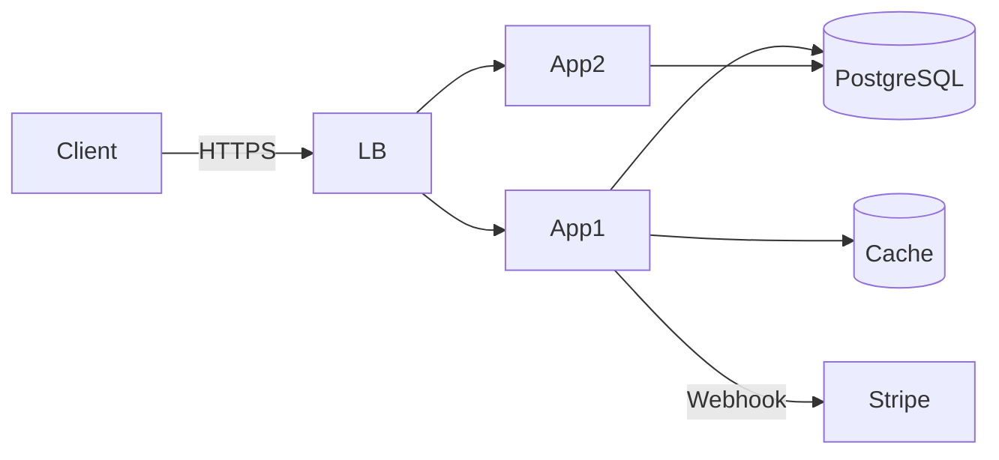

# Nash Framework — Improvements from Claude Prime & gstack

**Analysis Date:** 2026-03-16
**Source:** Comparison of Nash Framework vs Claude Prime vs gstack

---

## Executive Summary

Nash Framework đã có **foundation mạnh**:
- ✅ Adversarial review (Nash Triad)
- ✅ Zero-sum scoring (±5 to ±30 points)
- ✅ 6 pipelines (Trivial → Critical)
- ✅ Multi-task DAG + topological sort
- ✅ 3-tier memory (L2/RAM/HDD)
- ✅ **Skill factory** (tự động tạo skills)
- ✅ **Agent sharpening** (PEN/WIN entries)
- ✅ LEDGER immutable scoring

**Thiếu 10 features** giúp developer experience tốt hơn và production operations hiệu quả hơn:

| # | Feature | Source | Priority | Impact |
|---|---------|--------|----------|--------|
| 1 | Auto-configuration | Claude Prime | **HIGH** | Reduce setup time hours → minutes |
| 2 | Polymorphic agent | Claude Prime | **HIGH** | Reduce orchestration overhead |
| 3 | Greptile integration | gstack | **MEDIUM** | Automate PR review triage |
| 4 | Diff-aware QA | gstack | **HIGH** | Test only affected routes (10× faster) |
| 5 | Health scoring | gstack | **MEDIUM** | Track quality improvement over time |
| 6 | Shipping automation | gstack | **HIGH** | One-command deploy workflow |
| 7 | CEO-level planning | gstack | **CRITICAL** | Prevent building wrong product |
| 8 | Forced diagrams | gstack | **MEDIUM** | Eliminate vague architecture |
| 9 | Browser automation | gstack | **HIGH** | Enable UI verification |
| 10 | Team retrospective | gstack | **LOW** | Team performance analytics |

---

## 1. Auto-configuration (`/nash-prime`)

### Problem
- Setup Nash requires **manual configuration** of 24+ agents, 6 pipelines, rules
- No tool to analyze codebase → suggest pipeline type
- High barrier to entry for new users

### Solution from Claude Prime
`/optimus-prime` auto-configures project in 60 seconds:
1. Analyze codebase (stack, patterns, conventions)
2. Copy matching starter skills
3. Create path-scoped rules
4. Generate CLAUDE.md
5. Cleanup

### Implementation for Nash

**File:** `agents/core/nash-prime.md`

```markdown
---
name: nash-prime
description: Auto-configure Nash Framework for new projects
archetype: [Strategist, Analyst]
---

## Role
Project configurator. Analyze codebase and configure Nash agents, pipelines, rules.

## Workflow

### 1. Analyze Codebase
Detect:
- Stack (check package.json, requirements.txt, go.mod)
- Framework (React/Vue/Angular, FastAPI/Django/Express)
- Database ORM (Prisma, TypeORM, SQLAlchemy, Drizzle)
- Testing (Jest, Vitest, Pytest, Go test)

### 2. Suggest Pipeline
Story Points → Pipeline type:
- <3 SP → Trivial
- 3-10 SP → Simple
- 10-30 SP → Complex
- 30+ SP → Critical
- Exploratory → NASH
- Time-critical → Urgent

### 3. Generate CONTRACT_DRAFT.md
Auto-populate 8 sections:
1. API Contracts (parse OpenAPI spec if exists)
2. Error Handling (detect error patterns)
3. Events/Pub-Sub (detect emitters, Redis)
4. Idempotency Rules (detect retry logic)
5. Mock Specifications (suggest test doubles)
6. Non-Functional Requirements (infer from code)
7. Acceptance Criteria (generate from stories)
8. Sign-off (Thesis/AT/Synthesis placeholders)

### 4. Agent Assignment
Match archetype to phase:
- Thesis → Builder (Thuc, Lan, Hoang)
- AT#1 → Critic (Moc, Son QA, Ngu)
- AT#2/3 → Strategist (Phuc SA, Hieu)

### 5. Create .nash/project/ refs
- architecture.md (system diagram)
- stack.md (tech stack summary)
- conventions.md (coding standards)

### 6. Generate plan.md template
Format: Pipeline type + SP + task checkboxes

## Output
Show preview → ask approval → apply
```

**Usage:**
```bash
claude --agent agents/core/nash-prime.md "Configure Nash for FastAPI + React project"
```

---

## 2. Polymorphic Agent (`the-mechanic`)

### Problem
- 24+ specialized agents → manual dispatch overhead
- Context loss between handoffs
- Main Agent orchestration complexity

### Solution from Claude Prime
Single polymorphic agent that auto-discovers skills:

```
Task: "Build React dashboard with real-time charts"

the-mechanic:
  1. Discovers: frontend-development, websocket, charts
  2. Combines all 3 skills
  3. Implements in 1 agent

Nash (current):
  Dung PM → Chau UX → Lan → Thuc
  → 3 handoffs, context loss
```

### Implementation for Nash

**File:** `agents/core/the-mechanic.md`

```markdown
---
name: the-mechanic
description: Polymorphic worker agent with auto-skill discovery
archetype: [Builder, Analyst, Critic, Strategist, Operator]
memory: local
---

## Philosophy
One agent, many expertise. Skills carry knowledge, agent executes.

## Workflow

### 1. Analyze Task
Extract domains:
- Frontend? → React/Vue/Angular
- Backend? → API, database, auth
- Infrastructure? → Docker, CI/CD
- QA? → Testing, browser automation

### 2. Discover Skills
Search `agents/skills/`:
```python
domains = extract_domains(task)
skills = []
for domain in domains:
    matches = glob(f"agents/skills/**/{domain}*/SKILL.md")
    skills.extend(matches)
```

### 3. Check Context
- `.claude/project/` (architecture)
- `.claude/rules/` (guardrails, auto-attach)
- `agents/{agent}/memory/` (failed approaches)

### 4. Priority Hierarchy
1. Project rules — HIGHEST
2. Skill guidelines
3. General best practices — LOWEST

### 5. Execute
Combine skills + context → implement

### 6. Update Memory
Save runtime discoveries:
- Hidden dependencies
- Failed approaches
- Environment quirks

Save to `.claude/agent-memory-local/{the-mechanic}/`:
- failed_approaches.md
- env_quirks.md
- deps_gotcha.md

## Constraints
- Discover skills before implementation
- Combine skills for multi-domain tasks
- Follow existing patterns
```

**Usage:**
```bash
# Instead of: Dung → Chau → Lan (3 agents)
claude --agent agents/core/the-mechanic.md "Build React dashboard"
→ Auto-discovers 3 skills, executes in 1 agent
```

---

## 3. Greptile Integration

### Problem
- No Greptile (YC PR review tool) integration
- Manual triage of Greptile comments
- No learning from false positives

### Solution from gstack
Auto-triage + auto-reply:
1. Fetch Greptile PR comments via API
2. Classify: VALID | ALREADY FIXED | FALSE POSITIVE
3. Fix valid issues
4. Auto-reply to all comments
5. Save FP patterns to history

### Implementation for Nash

**File:** `agents/skills/code-review-excellence/greptile-integration.md`

```markdown
## Greptile Workflow

### Step 1: Fetch
```bash
PR_NUM=$(gh pr view --json number -q .number)
gh api repos/{owner}/{repo}/pulls/$PR_NUM/comments \
  --jq '.[] | select(.user.login == "greptile-app")'
```

### Step 2: Classify

| Pattern | Classification |
|---------|----------------|
| Code changed in later commit | ALREADY FIXED |
| In suppression list | SUPPRESSED |
| Valid structural issue | VALID & ACTIONABLE |
| Other | FALSE POSITIVE (ask user) |

### Step 3: Action

| Classification | Action |
|----------------|--------|
| VALID | Add to CRITICAL findings → fix |
| ALREADY FIXED | Reply: "Fixed in {commit}" → save history |
| FALSE POSITIVE | Ask user → if confirmed: reply + save FP pattern |
| SUPPRESSED | Skip |

### Step 4: History
Save to `artifacts/{task}/greptile-history.md`:

```markdown
## 2026-03-16 PR #42

### VALID (Fixed)
- file:line — Race condition in payment
  → Fixed: Added advisory lock

### ALREADY FIXED
- file:line — Missing null check
  → commit abc123

### FALSE POSITIVE
- file:line — "Use constant-time comparison"
  → Already using secure_compare
  → Pattern saved
```

### Step 5: Suppress Known FPs
```bash
if grep -q "secure_compare FP" greptile-history.md; then
  classification="SUPPRESSED"
fi
```
```

**Integration:** Add as Step 2.5 in `code-review-excellence/SKILL.md`

---

## 4. Diff-aware QA

### Problem
- Test entire app when only 3 routes changed
- Manual test scope decision
- Waste time on unaffected areas

### Solution from gstack
`/qa` auto-detects affected routes from git diff:
1. Parse changed files
2. Extract affected routes
3. Test ONLY those routes
4. Report in <2 minutes

### Implementation for Nash

**File:** `agents/skills/qa-four-modes/diff-aware-mode.md`

```markdown
## Diff-Aware QA

### Step 1: Analyze Git Diff
```bash
git diff main --name-only > changed_files.txt
```

### Step 2: Extract Routes

| File Pattern | Route Extraction |
|--------------|------------------|
| `src/controllers/users.ts` | `/api/users/*` |
| `app/routes/listings.tsx` | `/listings/*` |
| `pages/dashboard/index.tsx` | `/dashboard` |
| `components/Checkout.tsx` | Find parent pages (grep usage) |

**Algorithm:**
```python
routes = set()
for file in changed_files:
    if "controller" in file or "route" in file:
        route = parse_route_definition(file)
        routes.add(route)
    elif "page" in file:
        route = file_path_to_route(file)
        routes.add(route)
    elif "component" in file:
        parents = grep_component_usage(file)
        routes.update(parents)
```

### Step 3: Auto-detect App URL
```bash
for port in 3000 3001 4000 5000 8000 8080; do
    if curl -s http://localhost:$port > /dev/null; then
        APP_URL="http://localhost:$port"
        break
    fi
done
```

### Step 4: Test Routes
```bash
for route in $routes; do
    /browse goto $APP_URL$route
    /browse screenshot /tmp/qa-${route}.png
    /browse console  # Check errors
done
```

### Step 5: Report
```markdown
## Diff-Aware QA Report

**Analyzed:** 12 files changed
**Affected routes:** 3
  - /listings/new (controller + view)
  - /listings/:id (view)
  - /api/listings (controller)

**Tests:**
✅ /listings/new — Form renders, submits
✅ /listings/:id — Detail loads
✅ /api/listings — Returns 200

**Console errors:** 0
**Duration:** 45 seconds
```
```

**Integration:** Add as Mode 1 in `qa-four-modes/SKILL.md`

---

## 5. Health Scoring

### Problem
- QA reports: PASS/FAIL (binary)
- Can't track improvement over time
- No breakdown by category

### Solution from gstack
Numeric health score with breakdown:
```
Health Score: 72/100

Breakdown:
  - Functionality: 85/100
  - Performance: 60/100
  - UI Quality: 75/100
  - Console Errors: 80/100
```

### Implementation for Nash

**File:** `agents/skills/qa-four-modes/health-scoring.md`

```markdown
## Health Scoring Algorithm

### Categories (4 × 25 points)

#### 1. Functionality (25 pts)
- All critical flows work: 25
- 1 broken flow: 15
- 2+ broken flows: 0

#### 2. Performance (25 pts)
- Page load <2s: 25
- 2-5s: 15
- >5s: 5

Measure:
```bash
/browse goto URL
/browse evaluate "performance.timing.loadEventEnd - performance.timing.navigationStart"
```

#### 3. UI Quality (25 pts)
Deductions:
- Broken layout: -10
- Overlap/clip: -5
- Missing images: -5
- Unreadable text: -10

#### 4. Console Errors (25 pts)
```bash
errors = /browse console
score = max(0, 25 - (errors.length * 5))
```

### Scoring Formula
```python
health_score = (
    functionality_score +
    performance_score +
    ui_quality_score +
    console_errors_score
)
```

### Trend Tracking
Save to `artifacts/{task}/qa-history.json`:
```json
{
  "2026-03-16T10:00:00Z": {
    "score": 72,
    "breakdown": {
      "functionality": 85,
      "performance": 60,
      "ui_quality": 75,
      "console_errors": 80
    },
    "issues": [
      {"severity": "CRITICAL", "desc": "Checkout form empty"},
      {"severity": "HIGH", "desc": "Mobile nav doesn't close"}
    ]
  }
}
```

### Report Format
```markdown
## QA Health Score: 72/100 (↑ +8)

| Category | Score | Change |
|----------|-------|--------|
| Functionality | 85/100 | ↑ +10 |
| Performance | 60/100 | ↓ -5 |
| UI Quality | 75/100 | → 0 |
| Console Errors | 80/100 | ↑ +3 |

### Top 3 Issues
1. **CRITICAL:** Checkout form submits empty
2. **HIGH:** Mobile nav doesn't close
3. **MEDIUM:** Chart overlaps sidebar <1024px
```
```

---

## 6. Shipping Automation (`/nash-ship`)

### Problem
- Manual git workflow: add → commit → push → PR
- No orchestrated flow
- Branches die before merging

### Solution from gstack
`/ship` orchestrates 8 steps in 1 command:
1. Sync main
2. Run tests
3. Review (two-pass + Greptile)
4. Fix critical issues
5. Bump version
6. Push
7. Create PR
8. Report

### Implementation for Nash

**File:** `agents/skills/deployment-excellence/nash-ship.md`

```markdown
## Nash Ship Workflow

### Pre-flight Checks
```bash
# On correct branch?
BRANCH=$(git branch --show-current)
if [ "$BRANCH" = "main" ]; then
    echo "ERROR: Cannot ship from main"
    exit 1
fi

# Has commits?
COMMITS=$(git log origin/main..HEAD --oneline | wc -l)
if [ $COMMITS -eq 0 ]; then
    echo "ERROR: No commits to ship"
    exit 1
fi
```

### Step 1: Sync Main
```bash
git fetch origin main --quiet
git merge origin/main --no-edit || {
    echo "CONFLICT: Resolve then re-run"
    exit 1
}
```

### Step 2: Run Tests
```bash
# Detect test command
if [ -f "package.json" ]; then
    TEST_CMD="npm test"
elif [ -f "go.mod" ]; then
    TEST_CMD="go test ./..."
elif [ -f "requirements.txt" ]; then
    TEST_CMD="pytest"
fi

$TEST_CMD || {
    echo "FAIL: Tests must pass"
    exit 1
}
```

### Step 3: Review
Execute `/review`:
- CRITICAL → MUST fix
- INFORMATIONAL → log to PR body

### Step 4: Version Bump
```bash
if [ -f "package.json" ]; then
    if git log origin/main..HEAD --oneline | grep -q "BREAKING"; then
        npm version major
    elif git log origin/main..HEAD --oneline | grep -q "feat"; then
        npm version minor
    else
        npm version patch
    fi
fi
```

### Step 5: Push
```bash
git push -u origin $BRANCH
```

### Step 6: Create PR
```bash
SUMMARY=$(git log origin/main..HEAD --oneline)
REVIEW=$(cat artifacts/current_task/review_findings.md)

gh pr create \
  --title "$(git log -1 --format=%s)" \
  --body "$(cat <<EOF
## Summary
$SUMMARY

## Review Findings
$REVIEW

## Test Plan
- [ ] Tests pass locally
- [ ] Manual QA on affected routes

🤖 Nash Ship
EOF
)"
```

### Output
```markdown
## Ship Report

✅ Synced with main (3 commits behind)
✅ Tests passed (24 tests, 0 failures)
✅ Review: 1 CRITICAL fixed, 2 INFORMATIONAL
✅ Version: 1.2.3 → 1.2.4
✅ Pushed to origin/feature-branch
✅ PR: https://github.com/user/repo/pull/42
```
```

---

## 7. CEO-level Planning (`/nash-ceo-review`)

### Problem
- MoE Router selects pipeline from technical audit
- No "rethink the problem" mode
- Risk: implement literal request → miss 10-star product

### Solution from gstack
`/plan-ceo-review` challenges request:
```
Request: "Add photo upload"

Output:
  "Photo upload" is NOT the feature.
  Real job: Help sellers create listings that SELL.

  10-star version:
    - Auto-identify product from photo
    - Pull specs + pricing comps
    - Auto-draft title/description
    - Suggest best hero image
```

### Implementation for Nash

**File:** `agents/skills/ceo-taste-validation/SKILL.md` (enhance existing)

Add section: **"10-Star Product Thinking"**

```markdown
## 10-Star Product Thinking

### Step 1: Challenge Request
Ask:
1. **What is user REALLY trying to achieve?**
   - Not the feature requested
   - The JOB they need done

2. **Is this symptom or root need?**
   - "Photo upload" → symptom
   - "Create listings that sell" → root need

3. **What's the 10-star version?**
   - Not "make it work"
   - "Make it inevitable, delightful, magical"

### Step 2: Expand Solution Space
Generate 3-5 alternatives:

**Example:**
```
Request: "Add photo upload"

Alternatives:
A) Basic upload (literal) — 1-star
B) Upload + validation — 3-star
C) Upload + auto-enhance — 5-star
D) Upload + product ID — 7-star
E) Smart listing flow — 10-star
   - Photo → identify → pull specs
   - Auto-draft title/description
   - Suggest best hero
   - Detect low quality → retake
   - Premium UX
```

### Step 3: Present Trade-offs
```markdown
## CEO Review: Photo Upload

### What User Asked
"Add photo upload"

### What They Really Need
Help sellers create listings that SELL

### 10-Star Vision
Smart listing flow:
1. Upload photo
2. Identify product (Vision API)
3. Pull SKU, specs, pricing
4. Auto-generate title/description
5. Suggest hero image
6. Quality check → retake if needed
7. Preview: "Buyers will see this"

### Tiers
| Tier | Scope | SP | Impact |
|------|-------|-------|--------|
| 1-star | Basic upload | 3 | Low |
| 5-star | Upload + enhance | 10 | Medium |
| 10-star | Smart flow | 30 | **HIGH** |

### Recommendation
Build 10-star. Why?
- Sellers want SALES, not uploads
- Competitive moat
- Premium positioning

### Decision Required
Which tier?
- A) 1-star (fast, low impact)
- B) 5-star (balanced)
- C) 10-star (ambitious) ← RECOMMENDED
```

### Output Format
```markdown
## CEO Review: {Task}

### Challenge
[Why literal request wrong]

### 10-Star Vision
[Magical experience]

### Tiers
[1/5/10-star trade-offs]

### Recommendation
[Tier + rationale]

### Gate
User approves → then Pipeline 2
```
```

**Integration:** Run BEFORE MoE Router

---

## 8. Forced Diagrams (`/nash-eng-review`)

### Problem
- Architecture docs CAN have diagrams, not REQUIRED
- Agents write vague text → hidden assumptions
- "Hand-wavy planning" acceptable

### Solution from gstack
Mandatory diagrams in `/plan-eng-review`:
1. Architecture diagram
2. Data flow diagram
3. State machine
4. Test matrix

**Why?** "LLMs get complete when forced to draw. Diagrams expose assumptions."

### Implementation for Nash

**File:** `agents/skills/eng-rigor-validation/SKILL.md` (enhance existing)

Add section: **"Mandatory Diagrams"**

```markdown
## Mandatory Diagrams

### Philosophy
Text is easy to fudge. Diagrams force precision.

### Required (Phase A: Define Criteria)

#### 1. Architecture Diagram (REQUIRED)
Format: Mermaid or ASCII

Must show:
- Components (App, DB, Cache, Queue, APIs)
- Boundaries (trust, network)
- Data flow (→)

Example:


Criteria:
- [ ] All components labeled
- [ ] Boundaries marked
- [ ] Data flow arrows

#### 2. Data Flow Diagram (REQUIRED for data features)
Shows: Request → Response path

Example:
```
User submits photo
    ↓
Upload endpoint
    ↓
Save to S3
    ↓
Enqueue job (vision)
    ↓
Background worker
    ↓
Vision API
    ↓
Extract metadata
    ↓
Search API (pricing)
    ↓
Draft generator (LLM)
    ↓
Save draft to DB
    ↓
Notify user (WebSocket)
```

#### 3. State Machine (REQUIRED for workflows)
Shows: States + transitions

Example:
```
[DRAFT] --submit--> [UPLOADED]
[UPLOADED] --classify--> [IDENTIFIED] | [UNKNOWN]
[IDENTIFIED] --enrich--> [ENRICHED]
[ENRICHED] --generate--> [READY]
[READY] --publish--> [LIVE]

Errors:
[UPLOADED] --fail--> [NEEDS_MANUAL]
[IDENTIFIED] --timeout--> [PARTIAL]
```

#### 4. Test Matrix (REQUIRED)
Scenarios × Test Types

| Scenario | Unit | Integration | E2E |
|----------|------|-------------|-----|
| Happy: valid photo → identified | ✓ | ✓ | ✓ |
| Edge: low confidence <70% | ✓ | ✓ | - |
| Error: Vision timeout | ✓ | ✓ | - |
| Error: Invalid file (PDF) | ✓ | - | - |
| Concurrency: 2 tabs upload | - | ✓ | ✓ |

### Enforcement

**Phase B (Completeness Audit):**
AT#1 checks:
- [ ] Architecture diagram present?
- [ ] Data flow (if data-heavy)?
- [ ] State machine (if workflow)?
- [ ] Test matrix?
- [ ] Diagrams PRECISE (not vague)?

**Penalty:**
Missing diagram → **P2 (-15 pts)** to Thesis

**Rationale:**
Vague architecture → bugs → P0 (-30) later
Better catch early.
```

---

## 9. Browser Automation (`/nash-browse`)

### Problem
- Nash has no browser skill yet
- Agents "half blind" — can't verify UI
- QA must manual test

### Solution from gstack
Compiled Playwright binary:
- First call: ~3s (start daemon)
- After: ~100-200ms per command
- Persistent session (cookies, tabs)

### Implementation for Nash

**Check existing:** `agents/skills/browser-automation/SKILL.md`

**If exists:** Verify has:
1. ✅ Persistent daemon (not restart per command)
2. ✅ Cookie import from macOS Keychain
3. ✅ Screenshot + OCR
4. ✅ Console error detection
5. ✅ Network HAR export

**If missing:** Port from gstack:
```bash
cp -r gstack-main/browse/ agents/skills/browser-automation/gstack-patterns.md
```

**Key commands:**
```bash
/browse goto URL
/browse click @selector
/browse fill @selector "text"
/browse screenshot path
/browse console
/browse text
```

**Integration:** Used by QA skills for UI verification

---

## 10. Team Retrospective (`/nash-retro`)

### Problem
- No team analytics
- Can't track metrics (LOC, test ratio, PR size)
- No per-contributor feedback

### Solution from gstack
`/retro` analyzes git history:
```
Week of Mar 1: 47 commits (3 contributors)
3.2k LOC, 38% tests, 12 PRs

## Your Week
32 commits, +2.4k LOC
Biggest: cookie import system

## Team
### Alice
12 commits, disciplined (<200 LOC/PR)
Opportunity: test ratio 12%

### Bob
3 commits — fixed N+1 query
Opportunity: only 1 active day
```

### Implementation for Nash

**File:** `agents/skills/team-retro/SKILL.md` (create new)

```markdown
---
name: team-retro
description: Engineering team retrospective with analytics
archetype: [Strategist, Analyst]
---

## Workflow

### Step 1: Detect Time Range
```bash
# Default: last 7 days
START=$(date -d '7 days ago' +%Y-%m-%d)
END=$(date +%Y-%m-%d)
```

### Step 2: Gather Metrics
```bash
# Commits
COMMITS=$(git log --since=$START --oneline | wc -l)

# LOC
LOC=$(git log --since=$START --numstat | \
      awk '{add+=$1; del+=$2} END {print add-del}')

# Test ratio
TEST_LOC=$(git log --since=$START --numstat -- '*.test.*' | \
           awk '{add+=$1} END {print add}')
TEST_RATIO=$(echo "$TEST_LOC * 100 / $LOC" | bc)

# PRs
PRS=$(gh pr list --state merged --search "merged:>$START" --json number | jq length)

# Contributors
CONTRIBUTORS=$(git log --since=$START --format=%an | sort -u)
```

### Step 3: Per-Contributor
```bash
for contributor in $CONTRIBUTORS; do
    commits=$(git log --since=$START --author="$contributor" --oneline | wc -l)
    loc=$(git log --since=$START --author="$contributor" --numstat | \
          awk '{add+=$1; del+=$2} END {print add-del}')
    test_ratio=$(...)
    active_days=$(git log --since=$START --author="$contributor" --format=%ad --date=short | sort -u | wc -l)
    peak_hour=$(...)
    biggest=$(...)
done
```

### Step 4: Report
```markdown
# Team Retro: {START} to {END}

## Overview
**{COMMITS} commits** by **{COUNT} contributors**
**{LOC} LOC** ({TEST_RATIO}% tests) | **{PRS} PRs**
**Peak:** {HOUR}:00 | **Streak:** {DAYS}d

## Your Week ({USER})
**{commits}** | **{loc} LOC** ({test_ratio}% tests)
**Peak:** {peak_hour}
**Biggest:** {biggest_commit}

**Strengths:** {praise}
**Opportunity:** {growth}

## Team

### {Contributor}
**{commits}** | **{loc} LOC** ({test_ratio}% tests)
**Focus:** {hotspots}
**Strengths:** {specific_praise}
**Opportunity:** {specific_growth}

## Top 3 Wins
1. {achievement with evidence}
2. {achievement with evidence}
3. {achievement with evidence}

## 3 Things to Improve
1. {issue with metric}
2. {issue with metric}
3. {issue with metric}

## 3 Habits for Next Week
1. {actionable habit}
2. {actionable habit}
3. {actionable habit}
```

### Step 5: Save Snapshot
```json
// artifacts/retro-{date}.json
{
  "date": "2026-03-16",
  "period": "2026-03-09 to 2026-03-16",
  "team": {
    "commits": 47,
    "loc": 3200,
    "test_ratio": 38,
    "prs": 12
  },
  "individuals": [...]
}
```

### Step 6: Trend
```bash
if [ -f "artifacts/retro-prev.json" ]; then
    PREV_LOC=$(jq .team.loc artifacts/retro-prev.json)
    DELTA=$((LOC - PREV_LOC))
    echo "LOC: $LOC (↑ +$DELTA)"
fi
```
```

---

## Priority Roadmap

### Phase 1: Foundation (Week 1-2)
**Goal:** Auto-config + polymorphic agent

1. ✅ `/nash-prime` (auto-configure)
2. ✅ `the-mechanic` (polymorphic)
3. ✅ Test on sample project

**Success:**
- Setup: <5 min (vs 2 hours)
- Agent discovers 3+ skills auto

### Phase 2: Operations (Week 3-4)
**Goal:** Shipping + QA automation

4. ✅ `/nash-ship` (port from gstack)
5. ✅ Diff-aware QA mode
6. ✅ Health scoring

**Success:**
- Ship: 1 command (vs 8 steps)
- QA: <2 min (vs 15 min)

### Phase 3: Planning (Week 5-6)
**Goal:** CEO thinking + diagrams

7. ✅ `/nash-ceo-review` (10-star thinking)
8. ✅ Forced diagrams
9. ✅ Update MoE Router

**Success:**
- 50% tasks challenged → better product
- 0 vague architectures

### Phase 4: Integrations (Week 7-8)
**Goal:** Greptile + browser + retro

10. ✅ Greptile integration
11. ✅ Verify browser-automation
12. ✅ Team-retro skill

**Success:**
- Greptile: 100% auto-triage
- UI: automated verification
- Team metrics: weekly retro

---

## Implementation Notes

### Use Skill Factory
Nash already has `skill_factory/` — use it!

```bash
# Generate from template
cp -r skill_factory/SKILL_TEMPLATE agents/skills/nash-prime
cd agents/skills/nash-prime

# Edit SKILL.md (use GSTACK_WRITING_STYLE.md)
# Register
node bin/nash register-skill nash-prime
```

### Use Agent Sharpening
**PEN entries** for violations:

```markdown
## PEN: Vague Architecture (-15pts)

**Violation:** No diagrams

**Evidence:** `artifacts/task-42/S1_criteria_spec.md`

**Penalty:** P2 (-15) to Thesis (Phuc SA)

**Fix:** Must include Mermaid diagram

**Status:** PERMANENT
```

Prevents repeat violations.

---

## Success Metrics

| Metric | Before | Target |
|--------|--------|--------|
| Setup time | 2 hours | <5 min |
| Agent dispatch | 3-5 agents | 1 agent |
| QA duration | 15 min | <2 min |
| Ship steps | 8 manual | 1 command |
| Vague architectures | 30% | 0% |
| Greptile triage | 10 min/PR | <1 min |
| UI verification | 0% (manual) | 100% |

**Review quarterly:** Hit targets?

---

## Conclusion

Nash has **strong foundations** (adversarial review, scoring, DAG).

Adding these **10 improvements**:
1. **Easier onboard** (auto-config)
2. **Faster execute** (polymorphic agent, diff-aware QA)
3. **Safer ship** (Greptile, diagrams)
4. **Better products** (CEO planning)

**Next:** Phase 1 — `/nash-prime` + `the-mechanic`

---

*Generated: 2026-03-16 | Source: Claude Prime & gstack analysis*