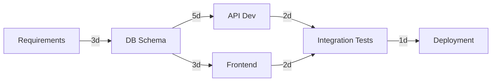

# Project Planning & Estimation

Agile planning patterns with story points, dependency mapping, PERT estimation, and risk-adjusted buffers for predictable delivery.

---

## Philosophy

Chess grandmaster planning 10 moves ahead. Board = sprint backlog, pieces = stories/dependencies, opponent = uncertainty.

**Three modes:** CRITICAL (no dependencies/estimates/criteria/buffer = STOP sprint), INFORMATIONAL (track velocity, retrospectives), RISK (unknowns get 2x multiplier).

**Core principle**: "Plans are worthless, but planning is everything." — Eisenhower.

---

## Prime Directives

1. **ALWAYS map dependencies BEFORE estimating.** Dependency tree first, estimates second. Example: "Build API" depends on "DB schema approved" (3-day blocker).

2. **Use Fibonacci story points (1, 2, 3, 5, 8, 13) for relative sizing.** Not hours. Story points measure complexity + uncertainty. Velocity normalizes across team skill levels.

3. **Apply 2x multiplier for unknowns.** New language/framework/infrastructure/domain/API = 2x. Example: Base 5 points + Unknown Stripe → 10 points.

4. **Buffer allocation: 20% for known risks, 50% for unknowns.** Sprint capacity = 30 points. Known risk = 6-point buffer. Unknown risk = 15-point buffer.

5. **Re-estimate when scope changes > 20%.** If 3 new stories added mid-sprint (30% scope increase), stop and re-plan.

6. **Track actual vs estimate for every story.** Estimated 5, took 8? Retrospective required. Pattern = missing criteria, hidden dependencies, or optimism.

7. **Anti-patterns to STOP immediately:**
   - Exact hour estimates (8.5 hours) → Use story points
   - No buffer (100% capacity planned) → No slack for incidents
   - Ignoring dependencies → Blocked developers, idle time
   - Estimating without breaking down (13+ points) → Too big for one sprint
   - No retrospective on missed estimates → No learning, repeated failures

---

## Estimation Techniques Table

| Technique | Best For | Scale | Accuracy | When to Use |
|-----------|----------|-------|----------|-------------|
| **Story Points (Fibonacci)** | Agile teams with stable velocity | 1,2,3,5,8,13,21 | High (±20%) | Sprint planning with established team |
| **T-shirt Sizes** | High-level roadmap, early backlog | XS,S,M,L,XL | Low (±50%) | Quarterly planning, epics |
| **Planning Poker** | Team estimation with debate | Fibonacci | High (consensus) | Sprint planning sessions |
| **PERT (3-Point)** | Risk analysis for critical path | Best/Likely/Worst | Medium (±30%) | High-risk features, new tech |

**PERT Formula:**
```
Expected Time = (Best + 4×Likely + Worst) / 6

Example: CSV export
Best: 2 days | Likely: 5 days | Worst: 10 days
Expected = (2 + 4×5 + 10) / 6 = 5.3 days ≈ 5 points
```

**Escape hatch:** Story > 13 points? STOP. Break into smaller stories (each < 8 points).

---

## Story Point Sizing Guide

| Points | Days | Complexity | Example | 2x Multiplier Examples |
|--------|------|------------|---------|------------------------|
| **1** | 0.5 | Trivial, copy-paste | Add GET /teams endpoint (duplicate GET /users) | - |
| **2** | 1 | Minor logic, well-understood | Email validation on signup form | - |
| **3** | 2 | New feature, clear requirements | CRUD API with tests | - |
| **5** | 3-5 | Moderate complexity, some unknowns | Multi-step checkout workflow | New language (TS→Go) = 10 pts: Goroutine leaks |
| **8** | 5-8 | High complexity, architecture changes | Refactor monolith to microservices | New framework (React→Svelte) = 16 pts → **Split** |
| **13** | 8-13 | Break down into smaller stories | Payment integration (Stripe webhooks, retry, 3DS) | New domain (payments) = 26 pts → **Split to 3 stories** |
| **21+** | >13 | MUST break down | Multi-tenant migration (100K users, 50 tenants) | **STOP: Epic planning required** |

**Unknown multipliers:** New programming language (2x), new framework (2x), new infrastructure (2x), domain gap (2x), third-party API (2x).

**Example:**
```
Story: Stripe payment integration
Base: 8 points | Unknown: Never used Stripe (2x)
Adjusted: 16 points → STOP, split into:
  - Story 1: Payment endpoint + basic flow (8 pts)
  - Story 2: Webhooks + retry + idempotency (8 pts)
```

---

## Dependency Mapping (Critical Path)

**Critical Path Method (Longest Chain):**



**Critical Path:** Requirements (3d) → DB Schema (5d) → API (5d) → Tests (2d) → Deploy (1d) = **16 days**
**Parallel:** Frontend (3d) starts after DB → Total **18 days** (vs 25 sequential)
**Bottlenecks:** DB review (weekly, submit Monday for 5d buffer) | Flaky tests (fix pre-sprint)

---

## Two-Pass Planning Workflow

### Pass 1: CRITICAL (Blocks Sprint Start)
**STOP sprint until:** Missing dependencies, no estimates, unclear criteria, no critical path, 0% buffer

### Pass 2: INFORMATIONAL (Improve Accuracy)
**Document (non-blocking):** Velocity tracking, actual vs estimate retrospectives, poker consensus, T-shirt refinement

---

## Production Disaster Example

**Story:** "Migrate 100K users MongoDB → PostgreSQL" | **Initial:** 2 weeks (10 pts) | **Actual:** 8 weeks (40 pts = 4x overrun)

**Unknowns missed:** Data integrity (NULL crashed NOT NULL), RLS migration, dual-write strategy, rollback plan

**Prevention:** Break into 8 stories (5 pts each) + 2x multiplier (new DB) = 16 pts/story × 8 = 128 pts + 50% buffer = 192 pts = 8 sprints (realistic)

---

## Meta-Instructions

**Planning Checklist (Use BEFORE Sprint Starts):**

1. [ ] Break epics into stories (< 13 points each)
2. [ ] Map dependencies (critical path identified)
3. [ ] Estimate with team (Planning Poker)
4. [ ] Apply 2x multiplier for unknowns
5. [ ] Add 20% buffer (known risks), 50% buffer (unknowns)
6. [ ] Assign owners and priorities (MoSCoW)
7. [ ] Document sprint goal (one sentence, outcome-focused)
8. [ ] Verify acceptance criteria (Given-When-Then)
9. [ ] Identify critical path and bottlenecks
10. [ ] Verify no CRITICAL blockers

**Stopping Policy (Re-Estimation Triggers):**

- Story > 13 points → STOP, break down (target 3-8 pts)
- 3+ re-estimates on same story → STOP, run spike task
- Critical path > sprint capacity → STOP, reduce scope or extend timeline
- Scope changes > 20% mid-sprint → STOP, re-plan

---

## Quick Reference

**PERT Formula:**
```
Expected = (Best + 4×Likely + Worst) / 6
```

**Sprint Template:**
```
Sprint N: [Goal] | Dates: [Start-End] | Capacity: [N] devs × [N] days = [N] pts
Buffer: 20-50% | Velocity: [N] pts/sprint (3-sprint avg)
Stories: [N] pts committed (within velocity)
Critical Path: [Chain] ([N] pts, [N] days) | Status: [Ready/Blocked]
```

**Production Wins:** Dependency mapping prevented 3-week PCI blocker | 2x multiplier caught Stripe idempotency bug before production

**Integration with Nash Framework:**
- Pipeline 1 (Requirements): Dũng PM creates backlog, Conan challenges scope creep
- Pipeline 2 (Architecture): Phúc SA maps technical dependencies, identifies critical path
- Pipeline 3 (Coding): Planning Poker estimation, daily standup burndown tracking

**Scoring (LEDGER):**
- P3 penalty (-10): Committing >130% velocity (overcommitment)
- P2 penalty (-15): <50% estimation accuracy (no learning)
- P4 reward (+5): 90%+ sprint completion rate (predictable delivery)

---

**End of Project Planning & Estimation Skill (v2.1 GSTACK)**
